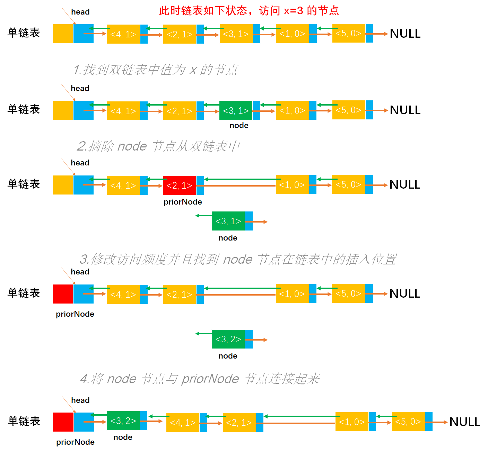

# Example046

## 题目

设头指针为 L 的带有表头结点的非循环双向链表，其每个结点中除有 `pred`（前驱指针）、`data`（数据）和 `next`（后继指针）域外，还有一个访问频度域 `freq`。在链表被启用前，其值均初始化为零。每当在链表中进行一次 `Locate(L,x)` 运算时，令元素值为 `x` 的结点中 `freq` 域的值增 1，并使此链表中结点保持按访问频度非增（递减）的顺序排列，同时最近访问的结点排在频度相同的结点前面，以便使频繁访问的结点总是靠近表头。试编写符合上述要求的 `Locate(L,x)` 运算的算法，该运算为函数过程，返回找到结点的地址，类型为指针型。


## 分析

本题考查的知识点：

- 双链表
- 双链表查找指定值结点
- 双链表删除节点
- 双链表插入节点

算法思想：首先在双链表中查找数据值等于 `x` 的节点 `node`，查到后，将该节点从链表上摘下（注意，恢复 `node->prior` 和 `node->next` 的连接），然后顺着节点的前驱链查找该节点的插入位置（按频度递减，且排在同频度的第一个，即向前找到第一个比它的频度大的节点，插入位置为该节点之后），最后插入到该位置。


## 图解




## C实现

核心代码：

```c
/**
 * 按访问频度来修改指定值节点在链表中的位置
 * @param list 双链表
 * @param x 指定值
 */
DLNode *locate(DLNode **list, int x) {
    // 1.找到双链表中值为 x 的节点
    // 变量，记录双链表节点用于扫描链表，初始为双链表的第一个节点
    DLNode *node = (*list)->next;
    // 从头到尾扫描双链表所有节点
    while (node != NULL) {
        // 找到节点值等于 x 的节点
        if (node->data == x) {
            break;
        }
        node = node->next;
    }

    // 2.摘除 node 节点从双链表中
    // 变量，记录 node 节点的前驱节点
    DLNode *priorNode = node->prior;
    // 摘除 node 节点，将 pre 节点与 node 节点的后继节点连接起来
    if (node->next != NULL) {
        node->next->prior = node->prior;
    }
    node->prior->next = node->next;

    // 3.修改访问频度并且找到 node 节点在链表中的插入位置
    // 将访问频度增加 1
    node->freq = node->freq + 1;
    // 找到 node 节点按访问频度应该在链表中的位置，即 node 节点应该插在 priorNode 节点的后面
    while (priorNode->prior != NULL && priorNode->prior->freq <= node->freq) {// 按访问频度，高频在前面，并且在同频的前面
        priorNode = priorNode->prior;
    }

    // 4.将 node 节点与 priorNode 节点连接起来
    node->next = priorNode->next;
    priorNode->next->prior = node;
    node->prior = priorNode;
    priorNode->next = node;
    return node;
}
```

完整代码：

```c
#include <stdio.h>
#include <malloc.h>

/**
 * 双链表节点结构体
 */
typedef struct DLNode {
    /**
     * 双链表节点数据域
     */
    int data;
    /**
     * 访问频度数据域
     */
    int freq;
    /**
     * 双链表节点的前驱节点，数据域
     */
    struct DLNode *prior;
    /**
     * 双链表节点的后继节点，数据域
     */
    struct DLNode *next;
} DLNode;

/**
 * 通过尾插法创建双链表
 * @param list 双链表
 * @param nums 会放入到双链表中的数据
 * @param n 数组长度
 * @return 创建成功的双链表
 */
DLNode *createByTail(DLNode **list, int nums[], int n) {
    // 1.初始化链表，即创建双链表的头结点，也可以直接调用 init 方法进行初始化
    // 1.1 给双链表头结点分配空间
    *list = (DLNode *) malloc(sizeof(DLNode));
    // 1.2 将双链表的 prior 指针指向 null
    (*list)->prior = NULL;
    // 1.3 将双链表的 next 指针指向 null
    (*list)->next = NULL;

    // 使用尾插法，最重要的是知道链表的尾节点，初始时为链表的头结点
    DLNode *tailNode = *list;

    // 2.循环数组中元素，然后插入到链表的尾部
    for (int i = 0; i < n; i++) {
        // 2.1 创建新节点
        // 2.1.1 为新节点分配空间
        DLNode *newNode = (DLNode *) malloc(sizeof(DLNode));
        // 2.1.2 指定新节点的数据域
        newNode->data = nums[i];
        // 2.1.3 将新节点的 prior 指针指向 null
        newNode->prior = NULL;
        // 2.1.4 将新节点的 next 指针指向 null
        newNode->next = NULL;
        // 2.1.5 将新节点的 freq 数据域初始为 0
        newNode->freq = 0;

        // 2.2 将新节点连接到链表中
        // 2.2.1 将原尾节点的 next 指针指向新节点
        tailNode->next = newNode;
        // 2.2.2 将新节点的 prior 指针指向原尾节点，这时已经将新节点连接到链表的尾部了
        newNode->prior = tailNode;
        // 2.2.3 不要忘记更新尾节点，让新节点成为新的尾节点，才能进行下一次插入
        tailNode = newNode;
    }
    return *list;
}

/**
 * 按访问频度来修改指定值节点在链表中的位置
 * @param list 双链表
 * @param x 指定值
 */
DLNode *locate(DLNode **list, int x) {
    // 1.找到双链表中值为 x 的节点
    // 变量，记录双链表节点用于扫描链表，初始为双链表的第一个节点
    DLNode *node = (*list)->next;
    // 从头到尾扫描双链表所有节点
    while (node != NULL) {
        // 找到节点值等于 x 的节点
        if (node->data == x) {
            break;
        }
        node = node->next;
    }

    // 2.摘除 node 节点从双链表中
    // 变量，记录 node 节点的前驱节点
    DLNode *priorNode = node->prior;
    // 摘除 node 节点，将 pre 节点与 node 节点的后继节点连接起来
    if (node->next != NULL) {
        node->next->prior = node->prior;
    }
    node->prior->next = node->next;

    // 3.修改访问频度并且找到 node 节点在链表中的插入位置
    // 将访问频度增加 1
    node->freq = node->freq + 1;
    // 找到 node 节点按访问频度应该在链表中的位置，即 node 节点应该插在 priorNode 节点的后面
    while (priorNode->prior != NULL && priorNode->prior->freq <= node->freq) {// 按访问频度，高频在前面，并且在同频的前面
        priorNode = priorNode->prior;
    }

    // 4.将 node 节点与 priorNode 节点连接起来
    node->next = priorNode->next;
    priorNode->next->prior = node;
    node->prior = priorNode;
    priorNode->next = node;
    return node;
}

/**
 * 打印双链表中所有节点数据
 * @param list 双链表
 */
void print(DLNode *list) {
    // 链表的第一个节点
    DLNode *node = list->next;
    // 循环遍历链表的所有节点
    printf("[");
    while (node != NULL) {
        printf("<%d,%d>", node->data, node->freq);
        if (node->next != NULL) {
            printf(", ");
        }
        node = node->next;
    }
    printf("]\n");
}

int main() {
    // 双链表
    DLNode *list;
    int nums[] = {1, 2, 3, 4, 5};
    int n = 5;
    createByTail(&list, nums, n);
    print(list);

    // 调用函数
    locate(&list, 3);
    print(list);
    locate(&list, 2);
    print(list);
    locate(&list, 4);
    print(list);
    locate(&list, 3);
    print(list);
}
```

执行结果：

```text
[<1,0>, <2,0>, <3,0>, <4,0>, <5,0>]
[<3,1>, <1,0>, <2,0>, <4,0>, <5,0>]
[<2,1>, <3,1>, <1,0>, <4,0>, <5,0>]
[<4,1>, <2,1>, <3,1>, <1,0>, <5,0>]
[<3,2>, <4,1>, <2,1>, <1,0>, <5,0>]
```


## Java实现

核心代码：

```java
    /**
     * 按访问频度来修改指定值节点在链表中的位置
     *
     * @param x 指定值
     */
    public DLNode locate(int x) {
        // 1.找到双链表中值为 x 的节点
        // 变量，记录双链表节点用于扫描链表，初始为双链表的第一个节点
        DLNode node = list.next;
        // 从头到尾扫描双链表所有节点
        while (node != null) {
            // 找到节点值等于 x 的节点
            if (node.data == x) {
                break;
            }
            node = node.next;
        }

        // 2.摘除 node 节点从双链表中
        // 变量，记录 node 节点的前驱节点
        DLNode priorNode = node.prior;
        // 摘除 node 节点，将 pre 节点与 node 节点的后继节点连接起来
        if (node.next != null) {
            node.next.prior = node.prior;
        }
        node.prior.next = node.next;

        // 3.修改访问频度并且找到 node 节点在链表中的插入位置
        // 将访问频度增加 1
        node.freq = node.freq + 1;
        // 找到 node 节点按访问频度应该在链表中的位置，即 node 节点应该插在 priorNode 节点的后面
        while (priorNode.prior != null && priorNode.prior.freq <= node.freq) {// 按访问频度，高频在前面，并且在同频的前面
            priorNode = priorNode.prior;
        }

        // 4.将 node 节点与 priorNode 节点连接起来
        node.next = priorNode.next;
        priorNode.next.prior = node;
        node.prior = priorNode;
        priorNode.next = node;
        return node;
    }
```

完整代码：

```java
public class DoubleLinkedList {
    DLNode list;

    /**
     * 通过尾插法创建双链表
     *
     * @param nums 会放入到双链表中的数据
     * @return 创建成功的双链表
     */
    public DLNode createByTail(int... nums) {
        // 1.初始化链表，即创建双链表的头结点，也可以直接调用 init 方法进行初始化
        // 1.1 给双链表头结点分配空间
        list = new DLNode();
        // 1.2 将双链表的 prior 指针指向 null
        list.prior = null;
        // 1.3 将双链表的 next 指针指向 null
        list.next = null;

        // 使用尾插法，最重要的是知道链表的尾节点，初始时为链表的头结点
        DLNode tailNode = list;

        // 2.循环数组中元素，然后插入到链表的尾部
        for (int i = 0; i < nums.length; i++) {
            // 2.1 创建新节点
            // 2.1.1 为新节点分配空间
            DLNode newNode = new DLNode();
            // 2.1.2 指定新节点的数据域
            newNode.data = nums[i];
            // 2.1.3 将新节点的 prior 指针指向 null
            newNode.prior = null;
            // 2.1.4 将新节点的 next 指针指向 null
            newNode.next = null;
            // 2.1.5 将新节点的 freq 频度置为 0
            newNode.freq = 0;

            // 2.2 将新节点连接到链表中
            // 2.2.1 将原尾节点的 next 指针指向新节点
            tailNode.next = newNode;
            // 2.2.2 将新节点的 prior 指针指向原尾节点，这时已经将新节点连接到链表的尾部了
            newNode.prior = tailNode;
            // 2.2.3 不要忘记更新尾节点，让新节点成为新的尾节点，才能进行下一次插入
            tailNode = newNode;
        }
        return list;
    }

    /**
     * 按访问频度来修改指定值节点在链表中的位置
     *
     * @param x 指定值
     */
    public DLNode locate(int x) {
        // 1.找到双链表中值为 x 的节点
        // 变量，记录双链表节点用于扫描链表，初始为双链表的第一个节点
        DLNode node = list.next;
        // 从头到尾扫描双链表所有节点
        while (node != null) {
            // 找到节点值等于 x 的节点
            if (node.data == x) {
                break;
            }
            node = node.next;
        }

        // 2.摘除 node 节点从双链表中
        // 变量，记录 node 节点的前驱节点
        DLNode priorNode = node.prior;
        // 摘除 node 节点，将 pre 节点与 node 节点的后继节点连接起来
        if (node.next != null) {
            node.next.prior = node.prior;
        }
        node.prior.next = node.next;

        // 3.修改访问频度并且找到 node 节点在链表中的插入位置
        // 将访问频度增加 1
        node.freq = node.freq + 1;
        // 找到 node 节点按访问频度应该在链表中的位置，即 node 节点应该插在 priorNode 节点的后面
        while (priorNode.prior != null && priorNode.prior.freq <= node.freq) {// 按访问频度，高频在前面，并且在同频的前面
            priorNode = priorNode.prior;
        }

        // 4.将 node 节点与 priorNode 节点连接起来
        node.next = priorNode.next;
        priorNode.next.prior = node;
        node.prior = priorNode;
        priorNode.next = node;
        return node;
    }

    /**
     * 打印双链表中所有节点数据
     */
    public void print() {
        // 链表的第一个节点
        DLNode node = list.next;
        // 循环遍历链表的所有节点
        String str = "[";
        while (node != null) {
            str += "<" + node.data + "," + node.freq + ">";
            if (node.next != null) {
                str += ", ";
            }
            node = node.next;
        }
        str += "]";
        // 打印结果
        System.out.println(str);
    }

}

/**
 * 双链表节点，包括一个数据域和两个指针域（分别指向前驱节点和后继节点）
 */
class DLNode {
    /**
     * 双链表节点的数据域
     */
    int data;
    /**
     * 双链表节点的访问频度
     */
    int freq;
    /**
     * 双链表节点的前驱节点
     */
    DLNode prior;
    /**
     * 双链表节点的后继节点
     */
    DLNode next;
}
```

测试代码：

```java
public class DoubleLinkedListTest {
    public static void main(String[] args) throws Exception {
        // 双链表
        DoubleLinkedList list = new DoubleLinkedList();
        list.createByTail(1, 2, 3, 4, 5);
        list.print();

        // 调用函数
        list.locate(3);
        list.print();
        list.locate(2);
        list.print();
        list.locate(4);
        list.print();
        list.locate(3);
        list.print();
    }
}
```

执行结果：

```text
[<1,0>, <2,0>, <3,0>, <4,0>, <5,0>]
[<3,1>, <1,0>, <2,0>, <4,0>, <5,0>]
[<2,1>, <3,1>, <1,0>, <4,0>, <5,0>]
[<4,1>, <2,1>, <3,1>, <1,0>, <5,0>]
[<3,2>, <4,1>, <2,1>, <1,0>, <5,0>]
```