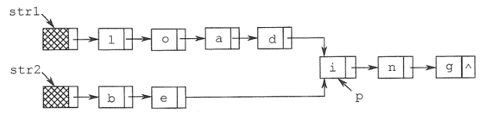
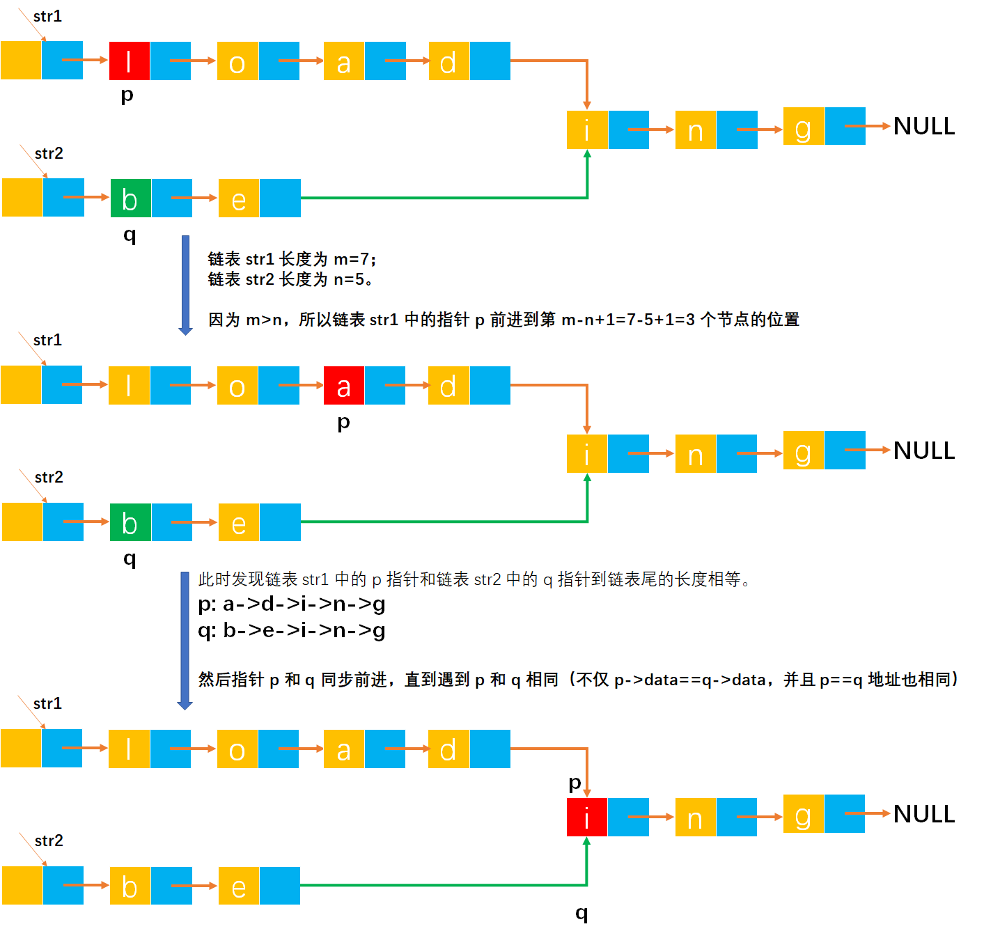

# Example047

## 题目

假定采用带头结点的单链表保存单词，当两个单词有相同的后缀时，可共享相同的后缀存储空间，例如，"loading" 和 "being" 的存储映像如下图所示。



设 str1 和 str2 分别指向两个单词所在单链表的头结点，链表结点结构为 `(data, next)`，请设计一个时间上尽可能高效的算法，找出由 str1 和 str2 所指向两个链表共同后缀的起始位置（如图中字符 `i` 所在结点的位置 `p`）。


## 分析

本题思想可以参考：[Example043-给定两个单链表，编写算法找出两个链表的公共节点-解法四](https://github.com/lcl100/data-structure-learning/blob/main/src/%E7%BA%BF%E6%80%A7%E8%A1%A8/%E7%BB%83%E4%B9%A0/Example043.md)

本题的结构体是单链表，采用双指针法。用指针 p 和 q 分别扫描 str1 和 str2，当 p 和 q 指向同一个地址时，即找到共同后缀的起始位置。算法的设计思想如下：
- ①分别求出单链表 str1 和 str2 两个链表的长度 m 和 n。
- ②将两个链表以表尾对齐：令指针 p 和 q 分别指向 str1 和 str2 的头结点，若 `m>=n` 则指针 p 先走，使 p 指向链表的第 `m-n+1` 个节点；若 `m<n` 则指针 q 先走，指向链表中的第 `n-m+1` 个节点，即使指针 p 和 q 所指的节点到表尾的长度相等。
- ③反复将指针 p 和 q 同步向后移动，当 p 和 q 指向同一位置时停止，即为共同后缀的起始位置，算法结束。

注意，可以参考 `Example043` 题中解法四的算法思想，但那一道题中公共链表节点是在两个不同链表不同地址中元素值相等的节点，而本题中公共链表节点是相同地址中元素值相等的节点。


## 图解




## C实现

核心代码：

```c
/**
 * 统计链表的结点个数
 * @param list 链表
 * @return 链表长度
 */
int size(LNode *list) {
    int len = 0;
    LNode *node = list->next;
    while (node != NULL) {
        len++;
        node = node->next;
    }
    return len;
}

/**
 * 寻找链表 str1 和 str2 的公共节点
 * @param str1 第一个链表
 * @param str2 第二个链表
 * @return 公共节点
 */
LNode *getCommonNode(LNode *str1, LNode *str2) {
    // 链表 str1 和 str2 的长度
    int m = size(str1);
    int n = size(str2);

    // 指向链表 str1 和 str2 的开始结点
    LNode *p = str1->next;
    LNode *q = str2->next;
    // 如果 m>=n 则 p 前进到第 m-n+1 个节点；如果 m<n 则 q 前进到第 n-m+1 个节点
    if (m >= n) {
        // p 前进
        int i = m - n;
        while (i > 0) {
            p = p->next;
            i--;
        }
    } else {
        // q 前进
        int i = n - m;
        while (i > 0) {
            q = q->next;
            i--;
        }
    }

    // p 和 q 同步前进，直到遇到 p 和 q 相等，结束循环
    while (p != NULL && q != NULL && p != q) {
        p = p->next;
        q = q->next;
    }
    // 此时无论是 p 还是 q 都是公共节点
    return p;
}
```

完整代码：

```c
#include <stdio.h>
#include <malloc.h>

/**
 * 单链表节点
 */
typedef struct LNode {
    /**
     * 单链表节点的数据域
     */
    char data;
    /**
     * 单链表节点的的指针域，指向当前节点的后继节点
     */
    struct LNode *next;
} LNode;

/**
 * 通过尾插法创建单链表
 * @param list 单链表
 * @param nums 创建单链表时插入的数据数组
 * @param n 数组长度
 * @return 创建好的单链表
 */
LNode *createByTail(LNode **list, char nums[], int n) {
    // 1.初始化单链表
    // 创建链表必须要先初始化链表，也可以选择直接调用 init() 函数
    *list = (LNode *) malloc(sizeof(LNode));
    (*list)->next = NULL;

    // 尾插法，必须知道链表的尾节点（即链表的最后一个节点），初始时，单链表的头结点就是尾节点
    // 因为在单链表中插入节点我们必须知道前驱节点，而头插法中的前驱节点一直是头节点，但尾插法中要在单链表的末尾插入新节点，所以前驱节点一直都是链表的最后一个节点，而链表的最后一个节点由于链表插入新节点会一直变化
    LNode *node = (*list);

    // 2.循环数组，将所有数依次插入到链表的尾部
    for (int i = 0; i < n; i++) {
        // 2.1 创建新节点，并指定数据域和指针域
        // 2.1.1 创建新节点，为其分配空间
        LNode *newNode = (LNode *) malloc(sizeof(LNode));
        // 2.1.2 为新节点指定数据域
        newNode->data = nums[i];
        // 2.1.3 为新节点指定指针域，新节点的指针域初始时设置为 null
        newNode->next = NULL;

        // 2.2 将新节点插入到单链表的尾部
        // 2.2.1 将链表原尾节点的 next 指针指向新节点
        node->next = newNode;
        // 2.2.2 将新节点置为新的尾节点
        node = newNode;
    }
    return *list;
}

/**
 * 统计链表的结点个数
 * @param list 链表
 * @return 链表长度
 */
int size(LNode *list) {
    int len = 0;
    LNode *node = list->next;
    while (node != NULL) {
        len++;
        node = node->next;
    }
    return len;
}

/**
 * 寻找链表 str1 和 str2 的公共节点
 * @param str1 第一个链表
 * @param str2 第二个链表
 * @return 公共节点
 */
LNode *getCommonNode(LNode *str1, LNode *str2) {
    // 链表 str1 和 str2 的长度
    int m = size(str1);
    int n = size(str2);

    // 指向链表 str1 和 str2 的开始结点
    LNode *p = str1->next;
    LNode *q = str2->next;
    // 如果 m>=n 则 p 前进到第 m-n+1 个节点；如果 m<n 则 q 前进到第 n-m+1 个节点
    if (m >= n) {
        // p 前进
        int i = m - n;
        while (i > 0) {
            p = p->next;
            i--;
        }
    } else {
        // q 前进
        int i = n - m;
        while (i > 0) {
            q = q->next;
            i--;
        }
    }

    // p 和 q 同步前进，直到遇到 p 和 q 相等，结束循环
    while (p != NULL && q != NULL && p != q) {
        p = p->next;
        q = q->next;
    }
    // 此时无论是 p 还是 q 都是公共节点
    return p;
}

/**
 * 打印链表的所有节点
 * @param list 单链表
 */
void print(LNode *list) {
    printf("[");
    // 链表的第一个节点
    LNode *node = list->next;
    // 循环单链表所有节点，打印值
    while (node != NULL) {
        printf("%c", node->data);
        if (node->next != NULL) {
            printf(", ");
        }
        node = node->next;
    }
    printf("]\n");
}

int main() {
    // 声明单链表 str1
    LNode *str1;
    char nums1[] = {'l', 'o', 'a', 'd'};
    int n1 = 4;
    createByTail(&str1, nums1, n1);
    print(str1);

    // 声明单链表 str2
    LNode *str2;
    char nums2[] = {'b', 'e'};
    int n2 = 2;
    createByTail(&str2, nums2, n2);
    print(str2);

    // 声明公共节点链表
    LNode *list;
    char nums[] = {'i', 'n', 'g'};
    int n = 3;
    createByTail(&list, nums, n);
    print(list);

    // 将链表 str1 和 str2 的尾节点都指向公共节点链表的第一个节点
    LNode *str11 = str1->next;
    while (str11->next != NULL) {
        str11 = str11->next;
    }
    str11->next = list->next;
    LNode *str22 = str2->next;
    while (str22->next != NULL) {
        str22 = str22->next;
    }
    str22->next = list->next;
    printf("\n");
    print(str1);
    print(str2);

    // 注意，上面的代码都是为了模拟测试链表，不需要关注。调用函数查找公共节点
    LNode *commonNode = getCommonNode(str1, str2);
    printf("第一个公共结点：%c\n", commonNode->data);
}
```

执行结果：

```text
[l, o, a, d]
[b, e]
[i, n, g]

[l, o, a, d, i, n, g]
[b, e, i, n, g]
第一个公共结点：i
```


## Java实现

核心代码：

```java
    /**
     * 计算指定单链表的节点个数
     *
     * @param L 指定单链表
     * @return 节点个数
     */
    public int size(LinkedList L) {
        // 计数器，记录链表节点个数
        int len = 0;
        // 链表的第一个结点
        LNode node = L.list.next;
        // 扫描链表，统计节点个数
        while (node != null) {
            len++;
            node = node.next;
        }
        return len;
    }

    /**
     * 查找链表 str1 和 str2 的公共节点
     *
     * @param str1 第一个链表
     * @param str2 第二个链表
     * @return 两个链表的公共节点
     */
    public LNode getCommonNode(LinkedList str1, LinkedList str2) {
        // 链表 str1 和 str2 的长度
        int m = size(str1);
        int n = size(str2);

        // 指向链表 str1 和 str2 的开始结点
        LNode p = str1.list.next;
        LNode q = str2.list.next;
        // 如果 m>=n 则 p 前进到第 m-n+1 个节点；如果 m<n 则 q 前进到第 n-m+1 个节点
        if (m >= n) {
            // p 前进
            int i = m - n;
            while (i > 0) {
                p = p.next;
                i--;
            }
        } else {
            // q 前进
            int i = n - m;
            while (i > 0) {
                q = q.next;
                i--;
            }
        }

        // p 和 q 同步前进，直到遇到 p 和 q 相等，结束循环
        while (p != null && q != null && p != q) {
            p = p.next;
            q = q.next;
        }
        // 此时无论是 p 还是 q 都是公共节点
        return p;
    }
```

完整代码：

```java
public class LinkedList {
    /**
     * 单链表
     */
    private LNode list;

    /**
     * 通过尾插法创建单链表
     *
     * @param nums 创建单链表时插入的数据
     * @return 创建好的单链表
     */
    public LNode createByTail(char... nums) {
        // 1.初始化单链表
        // 创建链表必须要先初始化链表，也可以选择直接调用 init() 函数
        list = new LNode();
        list.next = null;

        // 尾插法，必须知道链表的尾节点（即链表的最后一个节点），初始时，单链表的头结点就是尾节点
        // 因为在单链表中插入节点我们必须知道前驱节点，而头插法中的前驱节点一直是头节点，但尾插法中要在单链表的末尾插入新节点，所以前驱节点一直都是链表的最后一个节点，而链表的最后一个节点由于链表插入新节点会一直变化
        LNode tailNode = list;

        // 2.循环数组，将所有数依次插入到链表的尾部
        for (int i = 0; i < nums.length; i++) {
            // 2.1 创建新节点，并指定数据域和指针域
            // 2.1.1 创建新节点，为其分配空间
            LNode newNode = new LNode();
            // 2.1.2 为新节点指定数据域
            newNode.data = nums[i];
            // 2.1.3 为新节点指定指针域，新节点的指针域初始时设置为 null
            newNode.next = null;

            // 2.2 将新节点插入到单链表的尾部
            // 2.2.1 将链表原尾节点的 next 指针指向新节点
            tailNode.next = newNode;
            // 2.2.2 将新节点置为新的尾节点
            tailNode = newNode;
        }

        return list;
    }

    /**
     * 计算指定单链表的节点个数
     *
     * @param L 指定单链表
     * @return 节点个数
     */
    public int size(LinkedList L) {
        // 计数器，记录链表节点个数
        int len = 0;
        // 链表的第一个结点
        LNode node = L.list.next;
        // 扫描链表，统计节点个数
        while (node != null) {
            len++;
            node = node.next;
        }
        return len;
    }

    /**
     * 查找链表 str1 和 str2 的公共节点
     *
     * @param str1 第一个链表
     * @param str2 第二个链表
     * @return 两个链表的公共节点
     */
    public LNode getCommonNode(LinkedList str1, LinkedList str2) {
        // 链表 str1 和 str2 的长度
        int m = size(str1);
        int n = size(str2);

        // 指向链表 str1 和 str2 的开始结点
        LNode p = str1.list.next;
        LNode q = str2.list.next;
        // 如果 m>=n 则 p 前进到第 m-n+1 个节点；如果 m<n 则 q 前进到第 n-m+1 个节点
        if (m >= n) {
            // p 前进
            int i = m - n;
            while (i > 0) {
                p = p.next;
                i--;
            }
        } else {
            // q 前进
            int i = n - m;
            while (i > 0) {
                q = q.next;
                i--;
            }
        }

        // p 和 q 同步前进，直到遇到 p 和 q 相等，结束循环
        while (p != null && q != null && p != q) {
            p = p.next;
            q = q.next;
        }
        // 此时无论是 p 还是 q 都是公共节点
        return p;
    }

    /**
     * 连接两个单链表，将链表 L2 连接到链表 L1 的后面
     *
     * @param L1 第一个链表，链接后成为拥有 L1 和 L2 所有节点的链表
     * @param L2 第二个链表
     */
    public void concat(LinkedList L1, LinkedList L2) {
        // 链表 L1 和 L2 的第一个节点
        LNode node1 = L1.list.next;
        LNode node2 = L2.list.next;
        // 找到链表 L1 的尾节点
        while (node1.next != null) {
            node1 = node1.next;
        }
        // 然后将链表 L1 的尾节点的 next 指针指向链表 L2 的开始节点
        node1.next = node2;
    }

    /**
     * 打印单链表所有节点
     */
    public void print() {
        // 链表的第一个节点
        LNode node = list.next;
        // 循环打印
        String str = "[";
        while (node != null) {
            // 拼接节点的数据域
            str += node.data;
            // 只要不是最后一个节点，那么就在每个节点的数据域后面添加一个分号，用于分隔字符串
            if (node.next != null) {
                str += ", ";
            }
            // 继续链表的下一个节点
            node = node.next;
        }
        str += "]";
        // 打印链表
        System.out.println(str);
    }
}

/**
 * 单链表的节点
 */
class LNode {
    /**
     * 链表的数据域，暂时指定为 int 类型，因为 Java 支持泛型，可以指定为泛型，就能支持更多的类型了
     */
    char data;
    /**
     * 链表的指针域，指向该节点的下一个节点
     */
    LNode next;
}
```

测试代码：

```java
public class LinkedListTest {
    public static void main(String[] args) {
        // 创建单链表 str1
        LinkedList str1 = new LinkedList();
        str1.createByTail('l', 'o', 'a', 'd');
        str1.print();

        // 创建单链表 str2
        LinkedList str2 = new LinkedList();
        str2.createByTail('b', 'e');
        str2.print();

        // 创建公共节点链表
        LinkedList list = new LinkedList();
        list.createByTail('i', 'n', 'g');
        list.print();
        System.out.println();

        // 将链表 str1 和 str2 的尾节点都指向公共节点链表的第一个节点，为此专门写了一个函数来连接两个链表
        LinkedList ll = new LinkedList();
        ll.concat(str1, list);
        ll.concat(str2, list);
        str1.print();
        str2.print();

        // 注意，上面的代码都是为了模拟测试链表，不需要关注。调用函数查找公共节点
        LNode commonNode = ll.getCommonNode(str1, str2);
        System.out.println("第一个公共结点：" + commonNode.data);
    }
}
```

执行结果：

```text
[l, o, a, d]
[b, e]
[i, n, g]

[l, o, a, d, i, n, g]
[b, e, i, n, g]
第一个公共结点：i
```