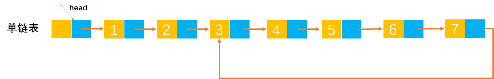
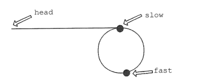
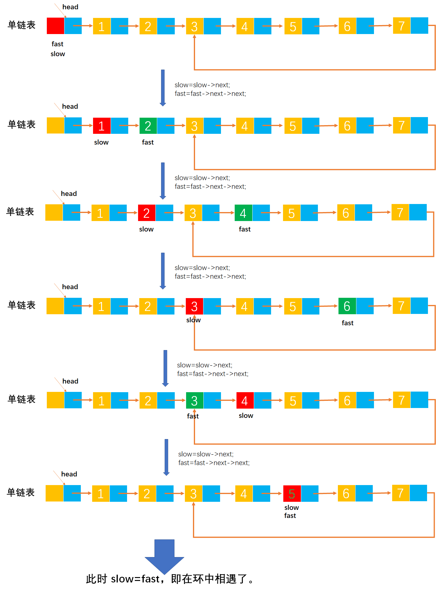
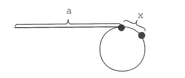
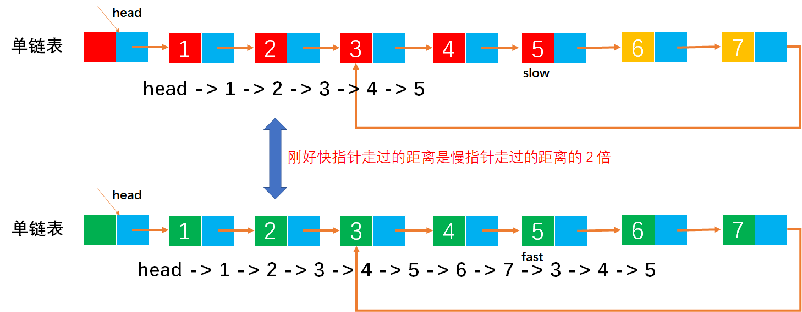
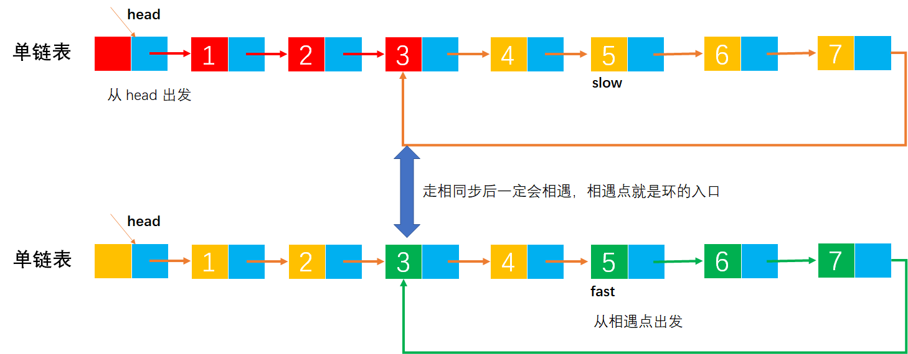
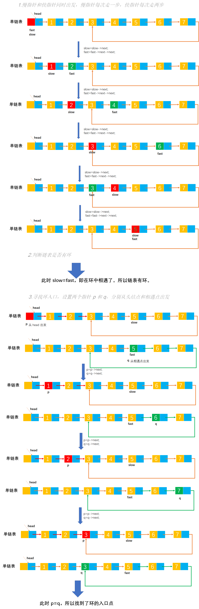

# Example048

## 题目

设计一个算法完成以下功能：判断一个链表是否有环，如果有，找出环的入口点并返回，否则返回 NULL。


## 分析

单链表有环如图（当走到 `7` 节点时，下一个节点又会走到 `3` 节点，然后一直循环）：



有一个很合适的例子来解决这个问题：在一个环形跑道上，两个运动员在同一地点起跑，一个运动员速度快，一个运动员速度慢。当两人跑了一段时间，速度快的运动员必然会从速度慢的运动员身后再次追上并超过，原因很简单，因为跑道是环形的。

所以设置快慢两个指针 `fast` 和 `slow`，初始时都指向链表的头结点 `head`。其中慢指针每次走一步，即 `slow=slow->next;`；而快指针每次走两步，即 `fast=fast->next->next;`。由于快指针 `fast` 比慢指针 `slow` 走得快，如果有环，那么快指针 `fast` 一定会先进入环，而慢指针 `slow` 后进入环。当两个指针都进入环后，经过若干步移动后，两个指针一定会在环上相遇，就如同跑得快的运动员和跑得慢的运动员一定会在跑道上相遇的。这样就可以判断一个链表是否有环。

如图所示，当 `slow` 刚进入环时，`fast` 早已经进入环。因为 `fast` 每次都比 `slow` 多走一步且 `fast` 与 `slow` 的距离小于环的长度，所以 `fast` 与 `slow` 相遇时，`slow` 所走的距离不超过环的长度。





下面就可以来说说如何找到环的入口了。如图所示，设头结点到环的入口点的距离为 a，环的入口点沿着环的方向到相遇点的距离为 x，环长为 r，相遇时 `fast` 绕过了 n 圈。则有 `2*(a+x)=a+n*r+x`（因为每次 `fast` 前进两步，`slow` 前进一步，所以 `fast` 走的距离一定是 `slow` 走的距离的两倍，因此有此公式。），即 `a=n*r-x`。显然从头结点到环的入口点的距离等于 n 倍的环长减去环的入口点到相遇点的距离。





因此可以设置两个指针，其中一个指向 head，一个指向相遇点，两个指针同步移动（均为一次走一步），相遇点即为环的入口点。




## 图解




## C实现

核心代码：

```c
/**
 * 判断链表是否有环，并且如果有环的话入口点在哪
 * @param list 单链表
 * @return 如果链表没有环则返回 NULL，如果链表有环则返回入口点
 */
LNode *findLoopStart(LNode *list) {
    // 设置快指针和慢指针，初始都指向链表的头结点
    LNode *fast = list;
    LNode *slow = list;

    // 1.慢指针和快指针同时出发，慢指针每次走一步，快指针每次走两步
    while (slow != NULL && fast->next != NULL) {// 因为快指针每次走两步，所以判断 fast->next 不为 null
        // 慢指针每次走一步
        slow = slow->next;
        // 快指针每次走两步
        fast = fast->next->next;
        // 如果快指针和慢指针相遇，则跳出循环，fast 和 slow 都指向相遇点
        if (slow == fast) {
            break;
        }
    }

    // 2.判断链表是否有环
    if (slow == NULL || fast->next ==
                        NULL) {// 因为上面 while 循环的循环条件是 slow!=NULL 和 fast->next!=NULL，所以当链表没有环的话，结束条件要么是 slow==NULL，要么是 fast->next==NULL
        // 如果没有环，则返回 NULL
        return NULL;
    }

    // 3.寻找环入口，设置两个指针 p 和 q，分别从头结点和相遇点出发
    LNode *p = list;
    LNode *q = slow;
    // 同时出发，每次前进一步
    while (p != q) {
        p = p->next;
        q = q->next;
    }
    // 返回入口点
    return p;
}
```

完整代码：

```c
#include <stdio.h>
#include <malloc.h>

/**
 * 单链表节点
 */
typedef struct LNode {
    /**
     * 单链表节点的数据域
     */
    int data;
    /**
     * 单链表节点的的指针域，指向当前节点的后继节点
     */
    struct LNode *next;
} LNode;

/**
 * 通过尾插法创建单链表
 * @param list 单链表
 * @param nums 创建单链表时插入的数据数组
 * @param n 数组长度
 * @return 创建好的单链表
 */
LNode *createByTail(LNode **list, int nums[], int n) {
    // 1.初始化单链表
    // 创建链表必须要先初始化链表，也可以选择直接调用 init() 函数
    *list = (LNode *) malloc(sizeof(LNode));
    (*list)->next = NULL;

    // 尾插法，必须知道链表的尾节点（即链表的最后一个节点），初始时，单链表的头结点就是尾节点
    // 因为在单链表中插入节点我们必须知道前驱节点，而头插法中的前驱节点一直是头节点，但尾插法中要在单链表的末尾插入新节点，所以前驱节点一直都是链表的最后一个节点，而链表的最后一个节点由于链表插入新节点会一直变化
    LNode *node = (*list);

    // 2.循环数组，将所有数依次插入到链表的尾部
    for (int i = 0; i < n; i++) {
        // 2.1 创建新节点，并指定数据域和指针域
        // 2.1.1 创建新节点，为其分配空间
        LNode *newNode = (LNode *) malloc(sizeof(LNode));
        // 2.1.2 为新节点指定数据域
        newNode->data = nums[i];
        // 2.1.3 为新节点指定指针域，新节点的指针域初始时设置为 null
        newNode->next = NULL;

        // 2.2 将新节点插入到单链表的尾部
        // 2.2.1 将链表原尾节点的 next 指针指向新节点
        node->next = newNode;
        // 2.2.2 将新节点置为新的尾节点
        node = newNode;
    }
    return *list;
}

/**
 * 判断链表是否有环，并且如果有环的话入口点在哪
 * @param list 单链表
 * @return 如果链表没有环则返回 NULL，如果链表有环则返回入口点
 */
LNode *findLoopStart(LNode *list) {
    // 设置快指针和慢指针，初始都指向链表的头结点
    LNode *fast = list;
    LNode *slow = list;

    // 1.慢指针和快指针同时出发，慢指针每次走一步，快指针每次走两步
    while (slow != NULL && fast->next != NULL) {// 因为快指针每次走两步，所以判断 fast->next 不为 null
        // 慢指针每次走一步
        slow = slow->next;
        // 快指针每次走两步
        fast = fast->next->next;
        // 如果快指针和慢指针相遇，则跳出循环，fast 和 slow 都指向相遇点
        if (slow == fast) {
            break;
        }
    }

    // 2.判断链表是否有环
    if (slow == NULL || fast->next ==
                        NULL) {// 因为上面 while 循环的循环条件是 slow!=NULL 和 fast->next!=NULL，所以当链表没有环的话，结束条件要么是 slow==NULL，要么是 fast->next==NULL
        // 如果没有环，则返回 NULL
        return NULL;
    }

    // 3.寻找环入口，设置两个指针 p 和 q，分别从头结点和相遇点出发
    LNode *p = list;
    LNode *q = slow;
    // 同时出发，每次前进一步
    while (p != q) {
        p = p->next;
        q = q->next;
    }
    // 返回入口点
    return p;
}

/**
 * 打印链表的所有节点
 * @param list 单链表
 */
void print(LNode *list) {
    printf("[");
    // 链表的第一个节点
    LNode *node = list->next;
    // 循环单链表所有节点，打印值
    while (node != NULL) {
        printf("%d", node->data);
        if (node->next != NULL) {
            printf(", ");
        }
        node = node->next;
    }
    printf("]\n");
}

int main() {
    // 声明单链表
    LNode *list;
    int nums[] = {1, 2, 3, 4, 5, 6, 7};
    int n = 7;
    createByTail(&list, nums, n);
    print(list);

    // 构造环
    // 找到链表的尾节点
    LNode *node = list->next;
    while (node->next != NULL) {
        node = node->next;
    }
    // 找到链表的第三个节点，将链表的第三个节点作为环的入口点
    LNode *temp = list;
    int i = 3;
    while (i > 0) {
        temp = temp->next;
        i--;
    }
    // 将链表的尾节点的 next 指针指向链表的第三个节点，就完成了链表环的构造
    node->next = temp;

    // 调用函数，判断是否是环，并且寻找环入口
    LNode *startNode = findLoopStart(list);
    if (startNode == NULL) {
        printf("该链表没有环！\n");
    } else {
        printf("该链表有环并且入口点是：%d\n", startNode->data);
    }
}
```

执行结果：

```text
[1, 2, 3, 4, 5, 6, 7]
该链表有环并且入口点是：3
```


## Java实现

核心代码：

```java
    /**
     * 判断链表是否有环，并且如果有环的话入口点在哪
     *
     * @return 如果链表没有环则返回 null，如果链表有环则返回入口点
     */
    LNode findLoopStart() {
        // 设置快指针和慢指针，初始都指向链表的头结点
        LNode fast = list;
        LNode slow = list;

        // 1.慢指针和快指针同时出发，慢指针每次走一步，快指针每次走两步
        while (slow != null && fast.next != null) {// 因为快指针每次走两步，所以判断 fast.next 不为 null
            // 慢指针每次走一步
            slow = slow.next;
            // 快指针每次走两步
            fast = fast.next.next;
            // 如果快指针和慢指针相遇，则跳出循环，fast 和 slow 都指向相遇点
            if (slow == fast) {
                break;
            }
        }

        // 2.判断链表是否有环
        if (slow == null || fast.next == null) {// 因为上面 while 循环的循环条件是 slow!=null 和 fast.next!=null，所以当链表没有环的话，结束条件要么是 slow==null，要么是 fast.next==null
            // 如果没有环，则返回 null
            return null;
        }

        // 3.寻找环入口，设置两个指针 p 和 q，分别从头结点和相遇点出发
        LNode p = list;
        LNode q = slow;
        // 同时出发，每次前进一步
        while (p != q) {
            p = p.next;
            q = q.next;
        }
        // 返回入口点
        return p;
    }
```

完整代码：

```java
public class LinkedList {
    /**
     * 单链表
     */
    private LNode list;

    /**
     * 通过尾插法创建单链表
     *
     * @param nums 创建单链表时插入的数据
     * @return 创建好的单链表
     */
    public LNode createByTail(int... nums) {
        // 1.初始化单链表
        // 创建链表必须要先初始化链表，也可以选择直接调用 init() 函数
        list = new LNode();
        list.next = null;

        // 尾插法，必须知道链表的尾节点（即链表的最后一个节点），初始时，单链表的头结点就是尾节点
        // 因为在单链表中插入节点我们必须知道前驱节点，而头插法中的前驱节点一直是头节点，但尾插法中要在单链表的末尾插入新节点，所以前驱节点一直都是链表的最后一个节点，而链表的最后一个节点由于链表插入新节点会一直变化
        LNode tailNode = list;

        // 2.循环数组，将所有数依次插入到链表的尾部
        for (int i = 0; i < nums.length; i++) {
            // 2.1 创建新节点，并指定数据域和指针域
            // 2.1.1 创建新节点，为其分配空间
            LNode newNode = new LNode();
            // 2.1.2 为新节点指定数据域
            newNode.data = nums[i];
            // 2.1.3 为新节点指定指针域，新节点的指针域初始时设置为 null
            newNode.next = null;

            // 2.2 将新节点插入到单链表的尾部
            // 2.2.1 将链表原尾节点的 next 指针指向新节点
            tailNode.next = newNode;
            // 2.2.2 将新节点置为新的尾节点
            tailNode = newNode;
        }

        return list;
    }

    /**
     * 判断链表是否有环，并且如果有环的话入口点在哪
     *
     * @return 如果链表没有环则返回 null，如果链表有环则返回入口点
     */
    LNode findLoopStart() {
        // 设置快指针和慢指针，初始都指向链表的头结点
        LNode fast = list;
        LNode slow = list;

        // 1.慢指针和快指针同时出发，慢指针每次走一步，快指针每次走两步
        while (slow != null && fast.next != null) {// 因为快指针每次走两步，所以判断 fast.next 不为 null
            // 慢指针每次走一步
            slow = slow.next;
            // 快指针每次走两步
            fast = fast.next.next;
            // 如果快指针和慢指针相遇，则跳出循环，fast 和 slow 都指向相遇点
            if (slow == fast) {
                break;
            }
        }

        // 2.判断链表是否有环
        if (slow == null || fast.next == null) {// 因为上面 while 循环的循环条件是 slow!=null 和 fast.next!=null，所以当链表没有环的话，结束条件要么是 slow==null，要么是 fast.next==null
            // 如果没有环，则返回 null
            return null;
        }

        // 3.寻找环入口，设置两个指针 p 和 q，分别从头结点和相遇点出发
        LNode p = list;
        LNode q = slow;
        // 同时出发，每次前进一步
        while (p != q) {
            p = p.next;
            q = q.next;
        }
        // 返回入口点
        return p;
    }

    /**
     * 以指定值为环的入口构造环
     *
     * @param start 环的入口，即链表中已有节点的数据值
     */
    public void createLoop(int start) {
        // 构造环
        // 找到链表的尾节点
        LNode node = list.next;
        while (node.next != null) {
            node = node.next;
        }
        // 找到链表的第三个节点，将链表的第三个节点作为环的入口点
        LNode temp = list;
        while (start > 0) {
            temp = temp.next;
            start--;
        }
        // 将链表的尾节点的 next 指针指向链表的第三个节点，就完成了链表环的构造
        node.next = temp;
    }

    /**
     * 打印单链表所有节点
     */
    public void print() {
        // 链表的第一个节点
        LNode node = list.next;
        // 循环打印
        String str = "[";
        while (node != null) {
            // 拼接节点的数据域
            str += node.data;
            // 只要不是最后一个节点，那么就在每个节点的数据域后面添加一个分号，用于分隔字符串
            if (node.next != null) {
                str += ", ";
            }
            // 继续链表的下一个节点
            node = node.next;
        }
        str += "]";
        // 打印链表
        System.out.println(str);
    }
}

/**
 * 单链表的节点
 */
class LNode {
    /**
     * 链表的数据域，暂时指定为 int 类型，因为 Java 支持泛型，可以指定为泛型，就能支持更多的类型了
     */
    int data;
    /**
     * 链表的指针域，指向该节点的下一个节点
     */
    LNode next;
}
```

测试代码：

```java
public class LinkedListTest {
    public static void main(String[] args) {
        // 创建单链表
        LinkedList list = new LinkedList();
        list.createByTail(1, 2, 3, 4, 5, 6, 7);
        list.print();

        // 构造环，创建测试环境
        list.createLoop(3);

        // 调用函数，判断是否是环，并且寻找环入口
        LNode startNode = list.findLoopStart();
        if (startNode == null) {
            System.out.println("该链表没有环！\n");
        } else {
            System.out.println("该链表有环并且入口点是：" + startNode.data);
        }
    }
}
```

执行结果：

```text
[1, 2, 3, 4, 5, 6, 7]
该链表有环并且入口点是：3
```