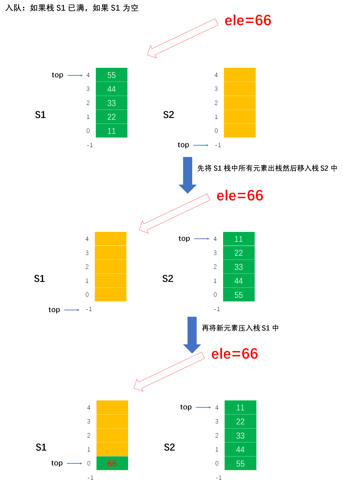

# Example001

## 题目

请利用两个栈 `s1` 和 `s2` 来模拟一个队列，假设栈中元素为 `int` 型，栈中元素最多为 `maxSize`。已知栈的 3 个运算定义如下：
- `push(ST, x)`：元素 x 入 ST 栈。
- `pop(ST, &x)`：ST 栈顶元素出栈，赋给变量 x。
- `isEmpty(ST)`：判断 ST 栈是否为空。

如何利用栈的运算来实现该队列的 3 个运算：`enQueue`（元素入队列）、`deQueue`（元素出队列）、`isQueueEmpty`（判断队列是否为空，空返回 1，不空返回 0）。


## 分析

利用两个栈 S1 和 S2 来模拟一个队列，当需要向队列中插入一个元素时，用栈 S1 来存放入队的元素，即 S1 执行入栈操作。当需要出队时，则对栈 S2 执行出栈操作。由于从栈中取出元素的顺序是原顺序的逆序，所以必须先将 S1 中的所有元素全部出栈并压入到 S2 栈中，再在 S2 中执行出栈操作，即可实现出队操作，而在执行此操作前必须判断 S2 是否为空，否则会导致顺序混乱。当 S1 和 S2 都为空时队列才为空。

之前也写过这题，可以参考：[考研数据结构之队列（3.3）——练习题之利用两个栈s1和s2来模拟一个队列，然后利用栈的运算来实现队列的enQueue、deQueue及isQueueEmpty运算（C表示）](https://blog.csdn.net/cnds123321/article/details/106456676)。


## 图解

- 空队列


- 非空队列


- 入队




- 出队


## C实现

核心代码：

```c
/**
 * 将元素入队
 * @param s1 一号栈，存入入队元素
 * @param s2 二号栈，存储待出队元素
 * @param ele 待入队元素
 * @return 如果入队成功则返回 1，否则返回 0 表示入队失败
 */
int enQueue(SeqStack *s1, SeqStack *s2, int ele) {
    // 1.根据栈 s1 是否满来操作
    // 1.1 如果栈 s1 是未满状态，那么可以一直直接将元素压入 s1 中，即使有待出队的元素也是在 s2 中，s1 毫无影响
    if (s1->top != MAXSIZE - 1) {
        push(s1, ele);
    }
    // 1.2 如果栈 s1 是已满状态，那说明栈 s1 已经放不下新元素了，那么可以将这些元素全部转移到栈 s2 中，转移之后，栈 s1 又能继续入队新元素了
    else {
        // 1.2.1 在栈 s1 已满的情况下，如果栈 s2 是非空，则不能入栈
        // 但是将 s1 中的全部元素转移到 s2 中有一个问题，即要求 s2 是空栈才能转移
        // 如果栈 s2 不是空栈，那么就不能将栈 s1 中的元素入栈，因为会影响原栈 s2 中的元素出队，会打乱队列先进先出的特性
        if (!isEmpty(*s2)) {
            return 0;
        }
        // 1.2.2 如果栈 s2 是空栈，那么就将栈 s1 中所有元素压入栈 s2 中
        else {
            // 1.2.2.1 将 s1 中所有元素压入栈 s2 中
            while (!isEmpty(*s1)) {
                // 局部变量，存储从栈 s1 出栈的栈顶元素
                int top;
                // 将栈 s1 的栈顶元素出栈
                pop(s1, &top);
                // 将刚才 s1 出出栈的栈顶元素压入栈 s2 中
                push(s2, top);
            }
            // 1.2.2.2 然后再将新元素压入栈 s1 中
            push(s1, ele);
        }
    }
    return 1;
}

/**
 * 将元素出队
 * @param s1 一号栈，存入入队元素
 * @param s2 二号栈，存储待出队元素
 * @param ele 用来保存出队的元素
 * @return 如果入队成功则返回 1，否则返回 0 表示入队失败
 */
int deQueue(SeqStack *s1, SeqStack *s2, int *ele) {
    // 局部变量，用来存储栈顶元素
    int top;

    // 1.根据栈 s2 是否为空来进行操作
    // 1.1 如果栈 s2 非空，那么直接将栈 s2 的栈顶元素出栈即可
    if (!isEmpty(*s2)) {
        pop(s2, &top);
        *ele = top;
    }
    // 1.2 如果栈 s2 为空，那么就需要检查下栈 s1 是否有已经入队的元素，如果 s1 中有元素，那么将 s1 中的所有元素压入栈 s2 中，然后将栈 s2 的栈顶元素出栈；如果 s1 中没有元素，则不能出队
    else {
        // 1.2.1 如果栈 s1 也为空，则没有元素可以出队，则返回 0 表示出队失败
        if (isEmpty(*s1)) {
            return 0;
        }
        // 1.2.2 如果栈 s1 非空，则将 s1 所有元素压入栈 s2 中，然后再将 s2 中的元素进行出栈
        else {
            // 1.2.2.1 将 s1 中的所有元素压入栈 s2 中
            while (!isEmpty(*s1)) {
                // 将栈 s1 的栈顶元素出栈
                pop(s1, &top);
                // 然后将 s1 出栈的栈顶元素压入栈 s2 中
                push(s2, top);
            }
            // 1.2.2.2 然后将栈 s2 的栈顶元素出栈
            pop(s2, &top);// 将栈 s2 的栈顶元素出栈
            *ele = top;// 用 ele 保存栈 s2 的出栈元素。其实这两行代码可以写成一步：pop(s2, ele)。
        }
    }
    return 1;
}

/**
 * 判断队列是否为空
 * @param s1 一号栈，存入入队元素
 * @param s2 二号栈，存储待出队元素
 * @return 如果队列为空则返回 1，否则返回 0
 */
int isQueueEmpty(SeqStack s1, SeqStack s2) {
    // 只有栈 s1 和 s2 同时为空，则才表示该队列为空
    // 因为栈 s1 是用来存储入队元素的，而栈 s2 用来存储出队元素的，所以只要有一个不为空，那么则表示队列不为空
    if (isEmpty(s1) && isEmpty(s2)) {
        return 1;
    } else {
        return 0;
    }
}
```

完整代码：

```c
#include<stdio.h>

/**
 * 顺序栈最大存储的元素个数
 */
#define MAXSIZE 5

/**
 * 顺序栈结构体定义
 */
typedef struct {
    /**
     * 数据域，数组，用来存储栈中元素
     */
    int data[MAXSIZE];
    /**
     * 指针域，表示栈顶指针，实际上就是数组下标
     */
    int top;
} SeqStack;

/**
 * 初始化顺序栈，即将栈顶指针指向 -1 表示空栈
 * @param stack 顺序栈
 */
void init(SeqStack *stack) {
    // 设定让栈顶指针指向 -1 表示为栈空
    stack->top = -1;
}

/**
 * 判断顺序栈是否为空
 * @param stack 顺序栈
 * @return 如果顺序栈为空则返回 1，否则返回 0
 */
int isEmpty(SeqStack stack) {
    // 只需要判断栈顶指针是否等于 -1 即可，如果是空栈则返回 1，不是空栈则返回 0
    if (stack.top == -1) {
        return 1;
    } else {
        return 0;
    }
}

/**
 * 将元素入栈
 * @param stack 顺序栈
 * @param ele 元素值
 * @return 如果栈满则返回 0 表示入栈失败；如果插入成功则返回 1
 */
int push(SeqStack *stack, int ele) {
    // 1.参数校验，如果栈满则不能入栈元素
    if (stack->top == MAXSIZE - 1) {
        // 如果栈满，则返回 0，表示不能入栈
        return 0;
    }
    // 2.先将栈顶指针加一，指向新空数组位置
    stack->top++;
    // 3.将新元素值填充到新位置中
    stack->data[stack->top] = ele;
    return 1;
}

/**
 * 将元素出栈
 * @param stack 顺序栈
 * @param ele 用来保存出栈的元素
 * @return 如果栈空则返回 0 表示出栈失败；否则返回 1 表示出栈成功
 */
int pop(SeqStack *stack, int *ele) {
    // 1.参数校验，栈空不能出栈
    if (stack->top == -1) {
        // 栈空，没有元素可出栈
        return 0;
    }
    // 2.用 ele 来保存顺序栈栈顶元素
    *ele = stack->data[stack->top];
    // 3.然后栈顶指针减一，表示出栈一个元素
    stack->top--;
    return 1;
}

/**
 * 将元素入队
 * @param s1 一号栈，存入入队元素
 * @param s2 二号栈，存储待出队元素
 * @param ele 待入队元素
 * @return 如果入队成功则返回 1，否则返回 0 表示入队失败
 */
int enQueue(SeqStack *s1, SeqStack *s2, int ele) {
    // 1.根据栈 s1 是否满来操作
    // 1.1 如果栈 s1 是未满状态，那么可以一直直接将元素压入 s1 中，即使有待出队的元素也是在 s2 中，s1 毫无影响
    if (s1->top != MAXSIZE - 1) {
        push(s1, ele);
    }
    // 1.2 如果栈 s1 是已满状态，那说明栈 s1 已经放不下新元素了，那么可以将这些元素全部转移到栈 s2 中，转移之后，栈 s1 又能继续入队新元素了
    else {
        // 1.2.1 在栈 s1 已满的情况下，如果栈 s2 是非空，则不能入栈
        // 但是将 s1 中的全部元素转移到 s2 中有一个问题，即要求 s2 是空栈才能转移
        // 如果栈 s2 不是空栈，那么就不能将栈 s1 中的元素入栈，因为会影响原栈 s2 中的元素出队，会打乱队列先进先出的特性
        if (!isEmpty(*s2)) {
            return 0;
        }
        // 1.2.2 如果栈 s2 是空栈，那么就将栈 s1 中所有元素压入栈 s2 中
        else {
            // 1.2.2.1 将 s1 中所有元素压入栈 s2 中
            while (!isEmpty(*s1)) {
                // 局部变量，存储从栈 s1 出栈的栈顶元素
                int top;
                // 将栈 s1 的栈顶元素出栈
                pop(s1, &top);
                // 将刚才 s1 出出栈的栈顶元素压入栈 s2 中
                push(s2, top);
            }
            // 1.2.2.2 然后再将新元素压入栈 s1 中
            push(s1, ele);
        }
    }
    return 1;
}

/**
 * 将元素出队
 * @param s1 一号栈，存入入队元素
 * @param s2 二号栈，存储待出队元素
 * @param ele 用来保存出队的元素
 * @return 如果入队成功则返回 1，否则返回 0 表示入队失败
 */
int deQueue(SeqStack *s1, SeqStack *s2, int *ele) {
    // 局部变量，用来存储栈顶元素
    int top;

    // 1.根据栈 s2 是否为空来进行操作
    // 1.1 如果栈 s2 非空，那么直接将栈 s2 的栈顶元素出栈即可
    if (!isEmpty(*s2)) {
        pop(s2, &top);
        *ele = top;
    }
    // 1.2 如果栈 s2 为空，那么就需要检查下栈 s1 是否有已经入队的元素，如果 s1 中有元素，那么将 s1 中的所有元素压入栈 s2 中，然后将栈 s2 的栈顶元素出栈；如果 s1 中没有元素，则不能出队
    else {
        // 1.2.1 如果栈 s1 也为空，则没有元素可以出队，则返回 0 表示出队失败
        if (isEmpty(*s1)) {
            return 0;
        }
        // 1.2.2 如果栈 s1 非空，则将 s1 所有元素压入栈 s2 中，然后再将 s2 中的元素进行出栈
        else {
            // 1.2.2.1 将 s1 中的所有元素压入栈 s2 中
            while (!isEmpty(*s1)) {
                // 将栈 s1 的栈顶元素出栈
                pop(s1, &top);
                // 然后将 s1 出栈的栈顶元素压入栈 s2 中
                push(s2, top);
            }
            // 1.2.2.2 然后将栈 s2 的栈顶元素出栈
            pop(s2, &top);// 将栈 s2 的栈顶元素出栈
            *ele = top;// 用 ele 保存栈 s2 的出栈元素。其实这两行代码可以写成一步：pop(s2, ele)。
        }
    }
    return 1;
}

/**
 * 判断队列是否为空
 * @param s1 一号栈，存入入队元素
 * @param s2 二号栈，存储待出队元素
 * @return 如果队列为空则返回 1，否则返回 0
 */
int isQueueEmpty(SeqStack s1, SeqStack s2) {
    // 只有栈 s1 和 s2 同时为空，则才表示该队列为空
    // 因为栈 s1 是用来存储入队元素的，而栈 s2 用来存储出队元素的，所以只要有一个不为空，那么则表示队列不为空
    if (isEmpty(s1) && isEmpty(s2)) {
        return 1;
    } else {
        return 0;
    }
}

int main() {
    // 声明两个顺序栈并初始化
    SeqStack s1;
    init(&s1);
    SeqStack s2;
    init(&s2);

    // 是否队空
    printf("\n是否队空：\n");
    int empty;
    empty = isQueueEmpty(s1, s2);
    printf("%d\n", empty);

    // 将元素入队
    enQueue(&s1, &s2, 11);
    enQueue(&s1, &s2, 22);
    enQueue(&s1, &s2, 33);
    enQueue(&s1, &s2, 44);
    enQueue(&s1, &s2, 55);
    enQueue(&s1, &s2, 66);
    enQueue(&s1, &s2, 77);

    // 将元素出队
    printf("\n将元素出队：\n");
    int ele;
    deQueue(&s1, &s2, &ele);
    printf("出队元素：%d\n", ele);
    deQueue(&s1, &s2, &ele);
    printf("出队元素：%d\n", ele);
    deQueue(&s1, &s2, &ele);
    printf("出队元素：%d\n", ele);
    deQueue(&s1, &s2, &ele);
    printf("出队元素：%d\n", ele);
}
```

执行结果：

```text
是否队空：
1

将元素出队：
出队元素：11
出队元素：22
出队元素：33
出队元素：44
```


## Java实现

核心代码：

```java
    /**
     * 将元素入队
     *
     * @param s1  一号栈，存入入队元素
     * @param s2  二号栈，存储待出队元素
     * @param ele 待入队元素
     * @throws Exception s1 已满，s2 非空不能入队则抛出该异常
     */
    public static void enQueue(SeqStack s1, SeqStack s2, int ele) throws Exception {
        // 1.根据栈 s1 是否满来操作
        // 1.1 如果栈 s1 是未满状态，那么可以一直直接将元素压入 s1 中，即使有待出队的元素也是在 s2 中，s1 毫无影响
        if (!s1.isFull()) {
            s1.push(ele);
        }
        // 1.2 如果栈 s1 是已满状态，那说明栈 s1 已经放不下新元素了，那么可以将这些元素全部转移到栈 s2 中，转移之后，栈 s1 又能继续入队新元素了
        else {
            // 1.2.1 在栈 s1 已满的情况下，如果栈 s2 是非空，则不能入栈
            // 但是将 s1 中的全部元素转移到 s2 中有一个问题，即要求 s2 是空栈才能转移
            // 如果栈 s2 不是空栈，那么就不能将栈 s1 中的元素入栈，因为会影响原栈 s2 中的元素出队，会打乱队列先进先出的特性
            if (!s2.isEmpty()) {
                throw new Exception("s1 已满，s2 非空因此不能入队！");
            }
            // 1.2.2 如果栈 s2 是空栈，那么就将栈 s1 中所有元素压入栈 s2 中
            else {
                // 1.2.2.1 将 s1 中所有元素压入栈 s2 中
                while (!s1.isEmpty()) {
                    // 将栈 s1 的栈顶元素出栈
                    int top = s1.pop();
                    // 将刚才 s1 出出栈的栈顶元素压入栈 s2 中
                    s2.push(top);
                }
                // 1.2.2.2 然后再将新元素压入栈 s1 中
                s1.push(ele);
            }
        }
    }

    /**
     * 将元素出队
     *
     * @param s1 一号栈，存入入队元素
     * @param s2 二号栈，存储待出队元素
     * @return 用来保存出队的元素
     * @throws Exception 如果栈 s1 和 s2 均为空则抛出此异常
     */
    public static int deQueue(SeqStack s1, SeqStack s2) throws Exception {
        // 局部变量，用来存储栈顶元素，即出队元素
        int ele = 0;

        // 1.根据栈 s2 是否为空来进行操作
        // 1.1 如果栈 s2 非空，那么直接将栈 s2 的栈顶元素出栈即可
        if (!s2.isEmpty()) {
            ele = s2.pop();
        }
        // 1.2 如果栈 s2 为空，那么就需要检查下栈 s1 是否有已经入队的元素，如果 s1 中有元素，那么将 s1 中的所有元素压入栈 s2 中，然后将栈 s2 的栈顶元素出栈；如果 s1 中没有元素，则不能出队
        else {
            // 1.2.1 如果栈 s1 也为空，则没有元素可以出队，则抛出异常表示出队失败
            if (s1.isEmpty()) {
                throw new Exception("s1 和 s2 均为空无可出队元素！");
            }
            // 1.2.2 如果栈 s1 非空，则将 s1 所有元素压入栈 s2 中，然后再将 s2 中的元素进行出栈
            else {
                // 1.2.2.1 将 s1 中的所有元素压入栈 s2 中
                while (!s1.isEmpty()) {
                    // 将栈 s1 的栈顶元素出栈
                    ele = s1.pop();
                    // 然后将 s1 出栈的栈顶元素压入栈 s2 中
                    s2.push(ele);
                }
                // 1.2.2.2 然后将栈 s2 的栈顶元素出栈，即出队元素
                ele = s2.pop();
            }
        }
        // 最后返回出队元素
        return ele;
    }

    /**
     * 判断队列是否为空
     *
     * @param s1 一号栈，存入入队元素
     * @param s2 二号栈，存储待出队元素
     * @return 如果队列为空则返回 1，否则返回 0
     */
    public static boolean isQueueEmpty(SeqStack s1, SeqStack s2) {
        return s1.isEmpty() && s2.isEmpty();
    }
```

完整代码：

```java
public class Test {
    public static void main(String[] args) throws Exception {
        // 声明两个顺序栈并初始化
        SeqStack s1 = new SeqStack();
        s1.init();
        SeqStack s2 = new SeqStack();
        s2.init();

        // 是否队空
        System.out.println("\n是否队空：");
        boolean empty;
        empty = isQueueEmpty(s1, s2);
        System.out.println(empty);

        // 将元素入队
        enQueue(s1, s2, 11);
        enQueue(s1, s2, 22);
        enQueue(s1, s2, 33);
        enQueue(s1, s2, 44);
        enQueue(s1, s2, 55);
        enQueue(s1, s2, 66);
        enQueue(s1, s2, 77);

        // 将元素出队
        System.out.println("\n将元素出队：");
        int ele;
        ele = deQueue(s1, s2);
        System.out.println("出队元素：" + ele);
        ele = deQueue(s1, s2);
        System.out.println("出队元素：" + ele);
        ele = deQueue(s1, s2);
        System.out.println("出队元素：" + ele);
        ele = deQueue(s1, s2);
        System.out.println("出队元素：" + ele);
    }

    /**
     * 将元素入队
     *
     * @param s1  一号栈，存入入队元素
     * @param s2  二号栈，存储待出队元素
     * @param ele 待入队元素
     * @throws Exception s1 已满，s2 非空不能入队则抛出该异常
     */
    public static void enQueue(SeqStack s1, SeqStack s2, int ele) throws Exception {
        // 1.根据栈 s1 是否满来操作
        // 1.1 如果栈 s1 是未满状态，那么可以一直直接将元素压入 s1 中，即使有待出队的元素也是在 s2 中，s1 毫无影响
        if (!s1.isFull()) {
            s1.push(ele);
        }
        // 1.2 如果栈 s1 是已满状态，那说明栈 s1 已经放不下新元素了，那么可以将这些元素全部转移到栈 s2 中，转移之后，栈 s1 又能继续入队新元素了
        else {
            // 1.2.1 在栈 s1 已满的情况下，如果栈 s2 是非空，则不能入栈
            // 但是将 s1 中的全部元素转移到 s2 中有一个问题，即要求 s2 是空栈才能转移
            // 如果栈 s2 不是空栈，那么就不能将栈 s1 中的元素入栈，因为会影响原栈 s2 中的元素出队，会打乱队列先进先出的特性
            if (!s2.isEmpty()) {
                throw new Exception("s1 已满，s2 非空因此不能入队！");
            }
            // 1.2.2 如果栈 s2 是空栈，那么就将栈 s1 中所有元素压入栈 s2 中
            else {
                // 1.2.2.1 将 s1 中所有元素压入栈 s2 中
                while (!s1.isEmpty()) {
                    // 将栈 s1 的栈顶元素出栈
                    int top = s1.pop();
                    // 将刚才 s1 出出栈的栈顶元素压入栈 s2 中
                    s2.push(top);
                }
                // 1.2.2.2 然后再将新元素压入栈 s1 中
                s1.push(ele);
            }
        }
    }

    /**
     * 将元素出队
     *
     * @param s1 一号栈，存入入队元素
     * @param s2 二号栈，存储待出队元素
     * @return 用来保存出队的元素
     * @throws Exception 如果栈 s1 和 s2 均为空则抛出此异常
     */
    public static int deQueue(SeqStack s1, SeqStack s2) throws Exception {
        // 局部变量，用来存储栈顶元素，即出队元素
        int ele = 0;

        // 1.根据栈 s2 是否为空来进行操作
        // 1.1 如果栈 s2 非空，那么直接将栈 s2 的栈顶元素出栈即可
        if (!s2.isEmpty()) {
            ele = s2.pop();
        }
        // 1.2 如果栈 s2 为空，那么就需要检查下栈 s1 是否有已经入队的元素，如果 s1 中有元素，那么将 s1 中的所有元素压入栈 s2 中，然后将栈 s2 的栈顶元素出栈；如果 s1 中没有元素，则不能出队
        else {
            // 1.2.1 如果栈 s1 也为空，则没有元素可以出队，则抛出异常表示出队失败
            if (s1.isEmpty()) {
                throw new Exception("s1 和 s2 均为空无可出队元素！");
            }
            // 1.2.2 如果栈 s1 非空，则将 s1 所有元素压入栈 s2 中，然后再将 s2 中的元素进行出栈
            else {
                // 1.2.2.1 将 s1 中的所有元素压入栈 s2 中
                while (!s1.isEmpty()) {
                    // 将栈 s1 的栈顶元素出栈
                    ele = s1.pop();
                    // 然后将 s1 出栈的栈顶元素压入栈 s2 中
                    s2.push(ele);
                }
                // 1.2.2.2 然后将栈 s2 的栈顶元素出栈，即出队元素
                ele = s2.pop();
            }
        }
        // 最后返回出队元素
        return ele;
    }

    /**
     * 判断队列是否为空
     *
     * @param s1 一号栈，存入入队元素
     * @param s2 二号栈，存储待出队元素
     * @return 如果队列为空则返回 1，否则返回 0
     */
    public static boolean isQueueEmpty(SeqStack s1, SeqStack s2) {
        return s1.isEmpty() && s2.isEmpty();
    }
}
```

`SeqStack`：

```java
public class SeqStack {
    /**
     * 常量，顺序栈所能容纳的最大元素个数
     */
    private final int MAXSIZE = 5;

    /**
     * 声明一个顺序栈
     */
    private Stack stack;

    /**
     * 初始化顺序栈
     */
    public void init() {
        // 实例化栈对象
        stack = new Stack();
        // 为数据域分配空间
        stack.data = new int[MAXSIZE];
        // 将顺序栈的栈顶指针指向 -1 表示空栈
        stack.top = -1;
    }

    /**
     * 判断顺序栈是否为空
     *
     * @return 如果顺序栈为空则返回 true，否则返回 false
     */
    public boolean isEmpty() {
        // 规定了 -1 表示空栈，所以只需要判断栈顶指针是否等于 -1 即可
        return stack.top == -1;
    }

    /**
     * 判断顺序栈是否满
     *
     * @return 如果顺序栈已满则返回 true，否则返回 false
     */
    public boolean isFull() {
        // 因为栈顶指针 top 存储的是数组下标，所以判断是否等于 MAXSIZE-1
        return stack.top == MAXSIZE - 1;
    }

    /**
     * 将指定元素入栈
     *
     * @param ele 指定元素
     * @throws Exception 如果栈满则不能入栈，抛出此异常
     */
    public void push(int ele) throws Exception {
        // 1.参数校验，如果栈满则不能入栈，抛出异常
        if (stack.top == MAXSIZE - 1) {// 因为栈顶指针 top 存储的是数组下标，所以判断是否等于 MAXSIZE-1
            throw new Exception("栈已满，不能再插入！");
        }
        // 2.先栈顶指针加 1，因为原栈顶指针处已经存储了元素，所以加一指向新的空位置
        stack.top++;
        // 3.在新的空位置处插入新元素，即为指定下标的数组元素赋值
        stack.data[stack.top] = ele;
    }

    /**
     * 将栈顶元素出栈
     *
     * @return 栈顶元素
     * @throws Exception 如果栈空则不能出栈，抛出此异常
     */
    public int pop() throws Exception {
        // 1.参数校验，如果栈空则不能出栈，抛出异常
        if (stack.top == -1) {// 因为栈空的定义是栈顶指针为 -1，所以如果栈顶指针为 -1 那么就是空栈，就不能出栈元素
            throw new Exception("栈为空，不能出栈元素！");
        }
        // 2.记录栈顶元素，因为要将该元素返回，即要出栈的元素
        int result = stack.data[stack.top];
        // 3.栈顶指针减一，因为原栈顶元素已经出栈了，栈中元素个数减一
        stack.top--;
        return result;
    }

    /**
     * 获取栈顶元素，但不出栈
     *
     * @return 栈顶元素
     * @throws Exception 如果栈空则不能出栈，抛出此异常
     */
    public int getTop() throws Exception {
        // 1.参数校验，如果栈空则不能出栈，抛出异常
        if (stack.top == -1) {
            throw new Exception("栈为空，不能获取栈顶元素！");
        }
        // 2.直接返回栈顶元素，但不出栈
        return stack.data[stack.top];
    }

    /**
     * 顺序栈中元素个数
     *
     * @return 栈中元素个数
     */
    public int size() {
        // top 表示栈顶指针，实际上就是数组 data 的下标，所以实际元素个数就是下标加一
        // 即使是空栈 top=-1，那么最后也会返回 0 表示元素个数为零个
        return stack.top + 1;
    }

    /**
     * 打印顺序栈中所有元素，从栈顶到栈底
     */
    public void print() {
        System.out.print("[");
        for (int i = stack.top; i >= 0; i--) {
            if (i != stack.top) {
                System.out.print(", ");
            }
            System.out.print(stack.data[i]);
        }
        System.out.print("]\n");
    }

    /**
     * 清空顺序栈
     */
    public void clear() {
        // 直接将栈顶指针指向 -1 即可表示空栈，不用重置栈中已有元素的值，因为顺序栈操作只跟栈顶指针有关
        stack.top = -1;
    }
}

/**
 * 栈定义
 */
class Stack {
    /**
     * 顺序栈用来存储元素的数组
     */
    int[] data;
    /**
     * 记录顺序栈的栈顶指针，即数组下标
     */
    int top;
}
```

执行结果：

```text
是否队空：
true

将元素出队：
出队元素：11
出队元素：22
出队元素：33
出队元素：44
```