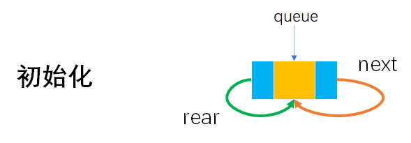
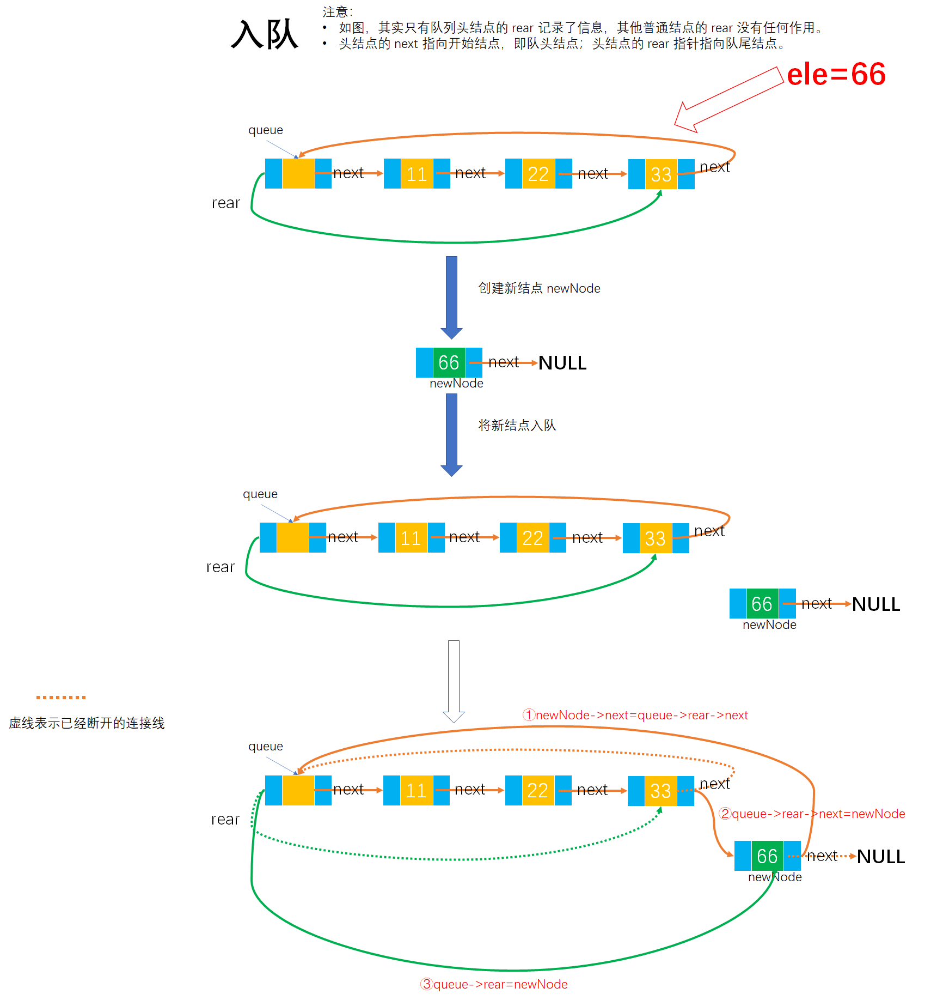
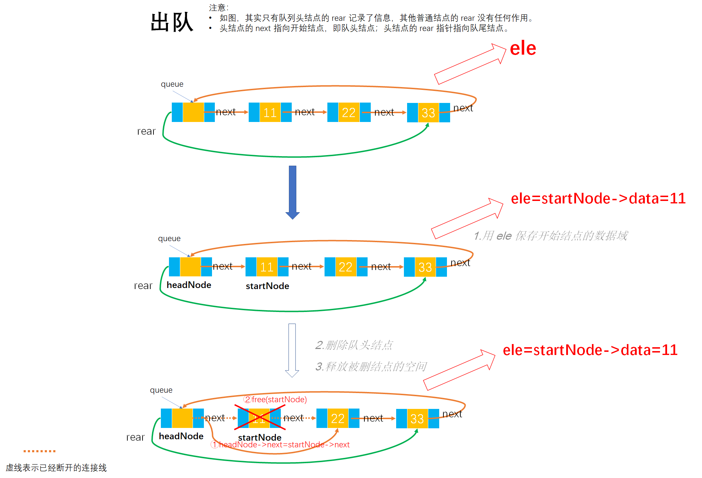

# Example002

## 题目

假设以带头结点的循环链表表示队列，并且只设一个指针指向队尾结点，但不设头指针，请写出相应的入队列和出队列的算法。


## 分析

注意，这里的不设头指针的意思是不设定队头指针。

我们设 `rear` 为带头结点的循环链队的尾指针，但 `rear` 却不是指向循环链队的头结点，而是指向循环链队的队尾结点。

本题是链队基本操作的扩展，知道尾指针后，要实现元素入队，则直接用链表的插入操作即可。要实现出队操作，则需要根据尾指针找出头结点和开始结点，然后进行删除。**要注意的是，尾指针应始终指向终端结点，并且当删除结点后队列为空时，必须特殊处理**。

注意：在解题时不必考虑结点的结构体，其实这里只需要用到单链表结点 `LNode` 就可以了，即只需要一个 `next` 指针就可以了，下面之所以使用 `CLNode` 结点并添加一个 `rear` 指针，是为了便于测试方法而写出来的。实际解题只需要在参数列表中传入队尾指针 `rear` 即可，不需要去考虑如何它是如何来的。如果下面的测试代码用的是单链表结点 LNode`，那么如果想要传入队尾指针作为参数，那么需要遍历单链表找到队尾结点，然后作为参数传入，当然这些都不在解题的考虑范围内。之所以解释这一段，也是因为我们不能只写具体算法，还要写能够测试写出来算法是否有效的其他代码。


## 图解

有点不太好理解，其实画个图就很容易看明白了，就是链表的插入和删除操作而已。

- 循环链队如图



- 循环链队元素入队如图



- 循环链队元素出队如图




## C实现

核心代码：

```c
/**
 * 将元素入队
 * @param rear 循环链式队列的尾指针，指向链式队列的尾结点
 * @param ele 待入队的元素
 */
void enQueue(CLNode **rear, int ele) {
    // 1.创建新结点
    // 1.1 为新结点分配存储空间
    CLNode *newNode = (CLNode *) malloc(sizeof(CLNode));
    // 1.2 为新结点指定数据域
    newNode->data = ele;
    // 1.2 为新结点指定指针域，新结点的指针域初始都指向 null
    newNode->next = NULL;

    // 2.将新结点入队
    // 2.1 将新结点的 next 指针指向原队尾结点的后继结点。即将新结点与原队列头结点连接起来
    // 实际上 rear 指向队尾结点；rear->next 由于是循环链式队列，所以指向的是头结点
    newNode->next = (*rear)->next;
    // 2.2 将原队尾结点的 next 指针指向新结点。即将原队列尾与新结点连接起来，才构成一个循环链
    (*rear)->next = newNode;
    // 2.3 将队尾指针指向新结点，即此时新结点成为了队列的队尾结点
    (*rear) = newNode;
}

/**
 * 将元素出队
 * @param rear 循环链式队列的尾指针，指向链式队列的尾结点
 * @param ele 保存出队的元素
 * @return 如果出队成功则返回 1，否则返回 0 表示出队失败
 */
int deQueue(CLNode **rear, int *ele) {
    // 0.参数校验，如果是空队列，则返回 0 表示不能出队。注意循环链表的判空条件
    if ((*rear)->next == *rear) {
        return 0;
    }

    // 其中 rear 指向队尾结点；rear->next 由于是循环链式队列，所以指向的是头结点
    // 局部变量，头结点
    CLNode *headNode = (*rear)->next;
    // 局部变量，开始结点。而头结点的后继结点就是开始结点
    CLNode *startNode = headNode->next;

    // 1.用 ele 保存开始结点的数据域，因为队列是从队头出队，所以就是出队开始结点
    *ele = startNode->data;
    // 2.删除队头结点。即将队头结点的 next 指针指向原开始结点的后继结点
    headNode->next = startNode->next;
    // 如果元素出队后队列为空，则需要特殊处理
    if (startNode==*rear){
        *rear=(*rear)->next;
    }
    // 3.释放被删结点的空间
    free(startNode);
    // 4.返回 1 表示出队成功
    return 1;
}
```

完整代码：

```c
#include<stdio.h>
#include<stdlib.h>

/**
 * 链式循环队列结点结构体定义
 */
typedef struct CLNode {
    /**
     * 结点数据域，存储结点的数据值
     */
    int data;
    /**
     * 结点指针域，存储当前结点的后继结点的地址
     */
    struct CLNode *next;
    /**
     * 结点指针域，即队尾指针，指向队尾结点，存储队列尾结点的地址
     */
    struct CLNode *rear;
} CLNode;

/**
 * 初始化队列
 * @param queue 未初始化的队列
 */
void init(CLNode **queue) {
    // 创建头结点，queue 即为链式队列的头结点，为头结点分配空间
    *queue = (CLNode *) malloc(sizeof(CLNode));
    // 将链式队列头结点的 next 和 rear 指针都指向自身，因为是循环的，并且是空队列
    (*queue)->next = *queue;
    (*queue)->rear = *queue;
}

/**
 * 将元素入队
 * @param rear 循环链式队列的尾指针，指向链式队列的尾结点
 * @param ele 待入队的元素
 */
void enQueue(CLNode **rear, int ele) {
    // 1.创建新结点
    // 1.1 为新结点分配存储空间
    CLNode *newNode = (CLNode *) malloc(sizeof(CLNode));
    // 1.2 为新结点指定数据域
    newNode->data = ele;
    // 1.2 为新结点指定指针域，新结点的指针域初始都指向 null
    newNode->next = NULL;

    // 2.将新结点入队
    // 2.1 将新结点的 next 指针指向原队尾结点的后继结点。即将新结点与原队列头结点连接起来
    // 实际上 rear 指向队尾结点；rear->next 由于是循环链式队列，所以指向的是头结点
    newNode->next = (*rear)->next;
    // 2.2 将原队尾结点的 next 指针指向新结点。即将原队列尾与新结点连接起来，才构成一个循环链
    (*rear)->next = newNode;
    // 2.3 将队尾指针指向新结点，即此时新结点成为了队列的队尾结点
    (*rear) = newNode;
}

/**
 * 将元素出队
 * @param rear 循环链式队列的尾指针，指向链式队列的尾结点
 * @param ele 保存出队的元素
 * @return 如果出队成功则返回 1，否则返回 0 表示出队失败
 */
int deQueue(CLNode **rear, int *ele) {
    // 0.参数校验，如果是空队列，则返回 0 表示不能出队。注意循环链表的判空条件
    if ((*rear)->next == *rear) {
        return 0;
    }

    // 其中 rear 指向队尾结点；rear->next 由于是循环链式队列，所以指向的是头结点
    // 局部变量，头结点
    CLNode *headNode = (*rear)->next;
    // 局部变量，开始结点。而头结点的后继结点就是开始结点
    CLNode *startNode = headNode->next;

    // 1.用 ele 保存开始结点的数据域，因为队列是从队头出队，所以就是出队开始结点
    *ele = startNode->data;
    // 2.删除队头结点。即将队头结点的 next 指针指向原开始结点的后继结点
    headNode->next = startNode->next;
    // 如果元素出队后队列为空，则需要特殊处理
    if (startNode==*rear){
        *rear=(*rear)->next;
    }
    // 3.释放被删结点的空间
    free(startNode);
    // 4.返回 1 表示出队成功
    return 1;
}

/**
 * 打印循环链式队列
 * @param queue 队列
 */
void print(CLNode *queue) {
    printf("[");
    CLNode *node = queue->next;
    while (node != queue) {
        printf("%d", node->data);
        if (node->next != queue) {
            printf(", ");
        }
        node = node->next;
    }
    printf("]\n");
}

int main() {
    // 声明队列
    CLNode *queue;

    // 初始化队列
    printf("\n初始化队列：\n");
    init(&queue);
    print(queue);

    // 将元素入队
    printf("\n将元素入队：\n");
    // 这里传入的参数可能有点难以理解，因为 enQueue 方法的第一个参数是双指针，所以传入的是指针变量的地址
    // queue是一个指针变量；&queue就是指针变量的地址，而queue->rear是为了获取队列的队尾指针，将队尾指针作为参数传入而非在函数内获取，是为了更直观了解函数的功能
    enQueue(&(queue->rear), 11);
    print(queue);
    enQueue(&(queue->rear), 22);
    print(queue);
    enQueue(&(queue->rear), 33);
    print(queue);
    enQueue(&(queue->rear), 44);
    print(queue);
    enQueue(&(queue->rear), 55);
    print(queue);
    enQueue(&(queue->rear), 66);
    print(queue);

    // 将元素出队
    printf("\n将元素出队：\n");
    int ele;
    deQueue(&(queue->rear), &ele);
    printf("出队元素：%d\n", ele);
    print(queue);
    deQueue(&(queue->rear), &ele);
    printf("出队元素：%d\n", ele);
    print(queue);
    deQueue(&(queue->rear), &ele);
    printf("出队元素：%d\n", ele);
    print(queue);
}
```

执行结果：

```text
初始化队列：
[]

将元素入队：
[11]
[11, 22]
[11, 22, 33]
[11, 22, 33, 44]
[11, 22, 33, 44, 55]
[11, 22, 33, 44, 55, 66]

将元素出队：
出队元素：11
[22, 33, 44, 55, 66]
出队元素：22
[33, 44, 55, 66]
出队元素：33
[44, 55, 66]
```

上面是纯 C 语言实现，而通常数据结构题目中会使用 `&` 来引用，而这属于 C++ 语言范畴，但这样更便于理解函数的功能，而非陷入 C 语言语法中忽略了算法的本质。但使用了 `&` 语法的代码在纯 C 语言编译器是无法通过编译的，可以使用 Dev-C++ 来执行代码。所以代码如下：

```c++
#include<stdio.h>
#include<stdlib.h>

/**
 * 链式循环队列结点结构体定义
 */
typedef struct CLNode {
    /**
     * 结点数据域，存储结点的数据值
     */
    int data;
    /**
     * 结点指针域，存储当前结点的后继结点的地址
     */
    struct CLNode *next;
    /**
     * 结点指针域，即队尾指针，指向队尾结点，存储队列尾结点的地址
     */
    struct CLNode *rear;
} CLNode;

/**
 * 初始化队列
 * @param queue 未初始化的队列
 */
void init(CLNode *&queue) {
    // 创建头结点，queue 即为链式队列的头结点，为头结点分配空间
    queue = (CLNode *) malloc(sizeof(CLNode));
    // 将链式队列头结点的 next 和 rear 指针都指向自身，因为是循环的，并且是空队列
    queue->next = queue;
    queue->rear = queue;
}

/**
 * 将元素入队
 * @param rear 循环链式队列的尾指针，指向链式队列的尾结点
 * @param ele 待入队的元素
 */
void enQueue(CLNode *&rear, int ele) {
    // 1.创建新结点
    // 1.1 为新结点分配存储空间
    CLNode *newNode = (CLNode *) malloc(sizeof(CLNode));
    // 1.2 为新结点指定数据域
    newNode->data = ele;
    // 1.2 为新结点指定指针域，新结点的指针域初始都指向 null
    newNode->next = NULL;

    // 2.将新结点入队
    // 2.1 将新结点的 next 指针指向原队尾结点的后继结点。即将新结点与原队列头结点连接起来
    // 实际上 rear 指向队尾结点；rear->next 由于是循环链式队列，所以指向的是头结点
    newNode->next = rear->next;
    // 2.2 将原队尾结点的 next 指针指向新结点。即将原队列尾与新结点连接起来，才构成一个循环链
    rear->next = newNode;
    // 2.3 将队尾指针指向新结点，即此时新结点成为了队列的队尾结点
    rear = newNode;
}

/**
 * 将元素出队
 * @param rear 循环链式队列的尾指针，指向链式队列的尾结点
 * @param ele 保存出队的元素
 * @return 如果出队成功则返回 1，否则返回 0 表示出队失败
 */
int deQueue(CLNode *&rear, int *ele) {
    // 0.参数校验，如果是空队列，则返回 0 表示不能出队。注意循环链表的判空条件
    if (rear->next == rear) {
        return 0;
    }

    // 其中 rear 指向队尾结点；rear->next 由于是循环链式队列，所以指向的是头结点
    // 局部变量，头结点
    CLNode *headNode = rear->next;
    // 局部变量，开始结点。而头结点的后继结点就是开始结点
    CLNode *startNode = headNode->next;

    // 1.用 ele 保存开始结点的数据域，因为队列是从队头出队，所以就是出队开始结点
    *ele = startNode->data;
    // 2.删除队头结点。即将队头结点的 next 指针指向原开始结点的后继结点
    headNode->next = startNode->next;
    // 如果元素出队后队列为空，则需要特殊处理
    if (startNode==*rear){
        *rear=(*rear)->next;
    }
    // 3.释放被删结点的空间
    free(startNode);
    // 4.返回 1 表示出队成功
    return 1;
}

/**
 * 打印循环链式队列
 * @param queue 队列
 */
void print(CLNode *queue) {
    printf("[");
    CLNode *node = queue->next;
    while (node != queue) {
        printf("%d", node->data);
        if (node->next != queue) {
            printf(", ");
        }
        node = node->next;
    }
    printf("]\n");
}

int main() {
    // 声明队列
    CLNode *queue;

    // 初始化队列
    printf("\n初始化队列：\n");
    init(queue);
    print(queue);

    // 将元素入队
    printf("\n将元素入队：\n");
    // 这里传入的参数可能有点难以理解，因为 enQueue 方法的第一个参数是双指针，所以传入的是指针变量的地址
    // queue是一个指针变量；&queue就是指针变量的地址，而queue->rear是为了获取队列的队尾指针，将队尾指针作为参数传入而非在函数内获取，是为了更直观了解函数的功能
    enQueue(queue->rear, 11);
    print(queue);
    enQueue(queue->rear, 22);
    print(queue);
    enQueue(queue->rear, 33);
    print(queue);
    enQueue(queue->rear, 44);
    print(queue);
    enQueue(queue->rear, 55);
    print(queue);
    enQueue(queue->rear, 66);
    print(queue);

    // 将元素出队
    printf("\n将元素出队：\n");
    int ele;
    deQueue(queue->rear, &ele);
    printf("出队元素：%d\n", ele);
    print(queue);
    deQueue(queue->rear, &ele);
    printf("出队元素：%d\n", ele);
    print(queue);
    deQueue(queue->rear, &ele);
    printf("出队元素：%d\n", ele);
    print(queue);
}
```


## Java实现

核心代码：

```java
    /**
     * 将元素入队
     *
     * @param ele 待入队的元素
     */
    public void enQueue(int ele) {
        // 1.创建新结点
        // 1.1 为新结点分配存储空间
        CLNode newNode = new CLNode();
        // 1.2 为新结点指定数据域
        newNode.data = ele;
        // 1.2 为新结点指定指针域，新结点的指针域初始都指向 null
        newNode.next = null;

        // 2.将新结点入队
        // 2.1 将新结点的 next 指针指向原队尾结点的后继结点。即将新结点与原队列头结点连接起来
        // 实际上 queue.rear 指向队尾结点；queue.rear.next 由于是循环链式队列，所以指向的是头结点
        newNode.next = queue.rear.next;
        // 2.2 将原队尾结点的 next 指针指向新结点。即将原队列尾与新结点连接起来，才构成一个循环链
        queue.rear.next = newNode;
        // 2.3 将队尾指针指向新结点，即此时新结点成为了队列的队尾结点
        queue.rear = newNode;
    }

    /**
     * 将元素出队
     *
     * @return 出队的元素
     * @throws Exception 如果队列为空则抛出该异常
     */
    public int deQueue() throws Exception {
        // 0.参数校验，如果是空队列，则抛出异常表示不能出队。注意循环链表的判空条件
        if (queue.rear == queue) {
            throw new Exception("空队列无法出队！");
        }

        // 其中 queue 表示头指针，指向队列的头结点，queue.rear 表示队尾指针，指向队尾结点；queue.rear.next 由于是循环链式队列，所以指向的是头结点
        // 局部变量，头结点
        CLNode headNode = queue.rear.next;
        // 局部变量，开始结点。而头结点的后继结点就是开始结点
        CLNode startNode = headNode.next;

        // 1.保存开始结点的数据域，因为队列是从队头出队，所以就是出队开始结点
        int data = startNode.data;
        // 2.删除队头结点。即将队头结点的 next 指针指向原开始结点的后继结点
        headNode.next = startNode.next;
        // 如果元素出队后队列为空，则需要特殊处理
        if (startNode == queue.rear) {
            queue.rear = queue.rear.next;
        }
        // 3.释放被删结点的空间
        startNode.next = null;
        startNode = null;
        // 4.返回出队元素
        return data;
    }
```

完整代码：

```java
public class Queue {
    /**
     * 声明链式循环队列，queue 即链式循环队列的头结点
     */
    private CLNode queue;

    /**
     * 初始化队列
     */
    public void init() {
        // 初始化链式队列
        queue = new CLNode();
        // 将链式队列头结点的 next 和 rear 指针都指向自身，因为是循环的，并且是空队列
        queue.next = queue;
        queue.rear = queue;
    }

    /**
     * 将元素入队
     *
     * @param ele 待入队的元素
     */
    public void enQueue(int ele) {
        // 1.创建新结点
        // 1.1 为新结点分配存储空间
        CLNode newNode = new CLNode();
        // 1.2 为新结点指定数据域
        newNode.data = ele;
        // 1.2 为新结点指定指针域，新结点的指针域初始都指向 null
        newNode.next = null;

        // 2.将新结点入队
        // 2.1 将新结点的 next 指针指向原队尾结点的后继结点。即将新结点与原队列头结点连接起来
        // 实际上 queue.rear 指向队尾结点；queue.rear.next 由于是循环链式队列，所以指向的是头结点
        newNode.next = queue.rear.next;
        // 2.2 将原队尾结点的 next 指针指向新结点。即将原队列尾与新结点连接起来，才构成一个循环链
        queue.rear.next = newNode;
        // 2.3 将队尾指针指向新结点，即此时新结点成为了队列的队尾结点
        queue.rear = newNode;
    }

    /**
     * 将元素出队
     *
     * @return 出队的元素
     * @throws Exception 如果队列为空则抛出该异常
     */
    public int deQueue() throws Exception {
        // 0.参数校验，如果是空队列，则抛出异常表示不能出队。注意循环链表的判空条件
        if (queue.rear == queue) {
            throw new Exception("空队列无法出队！");
        }

        // 其中 queue 表示头指针，指向队列的头结点，queue.rear 表示队尾指针，指向队尾结点；queue.rear.next 由于是循环链式队列，所以指向的是头结点
        // 局部变量，头结点
        CLNode headNode = queue.rear.next;
        // 局部变量，开始结点。而头结点的后继结点就是开始结点
        CLNode startNode = headNode.next;

        // 1.保存开始结点的数据域，因为队列是从队头出队，所以就是出队开始结点
        int data = startNode.data;
        // 2.删除队头结点。即将队头结点的 next 指针指向原开始结点的后继结点
        headNode.next = startNode.next;
       	// 如果元素出队后队列为空，则需要特殊处理
        if (startNode == queue.rear) {
            queue.rear = queue.rear.next;
        }
        // 3.释放被删结点的空间
        startNode.next = null;
        startNode = null;
        // 4.返回出队元素
        return data;
    }

    /**
     * 打印循环链式队列
     */
    public void print() {
        System.out.print("[");
        CLNode node = queue.next;
        while (node != queue) {
            System.out.print(node.data);
            if (node.next != queue) {
                System.out.print(", ");
            }
            node = node.next;
        }
        System.out.print("]\n");
    }
}

/**
 * 链式循环队列结点定义
 */
class CLNode {
    /**
     * 结点数据域，存储结点的数据值
     */
    int data;
    /**
     * 结点指针域，存储当前结点的后继结点的地址
     */
    CLNode next;
    /**
     * 结点指针域，即队尾指针，指向队尾结点，存储队列尾结点的地址
     */
    CLNode rear;
}
```

测试代码：

```java
public class Test {
    public static void main(String[] args) throws Exception {
        Queue queue = new Queue();

        // 队列初始化
        System.out.println("队列初始化：");
        queue.init();
        queue.print();

        // 将元素入队
        System.out.println("\n将元素入队：");
        queue.enQueue(11);
        queue.print();
        queue.enQueue(22);
        queue.print();
        queue.enQueue(33);
        queue.print();
        queue.enQueue(44);
        queue.print();
        queue.enQueue(55);
        queue.print();
        queue.enQueue(66);
        queue.print();

        // 将元素出队
        System.out.println("\n将元素出队：");
        int ele;
        ele = queue.deQueue();
        System.out.println("出队元素：" + ele);
        queue.print();
        ele = queue.deQueue();
        System.out.println("出队元素：" + ele);
        queue.print();
        ele = queue.deQueue();
        System.out.println("出队元素：" + ele);
        queue.print();

    }
}
```

执行结果：

```text
队列初始化：
[]

将元素入队：
[11]
[11, 22]
[11, 22, 33]
[11, 22, 33, 44]
[11, 22, 33, 44, 55]
[11, 22, 33, 44, 55, 66]

将元素出队：
出队元素：11
[22, 33, 44, 55, 66]
出队元素：22
[33, 44, 55, 66]
出队元素：33
[44, 55, 66]
```

