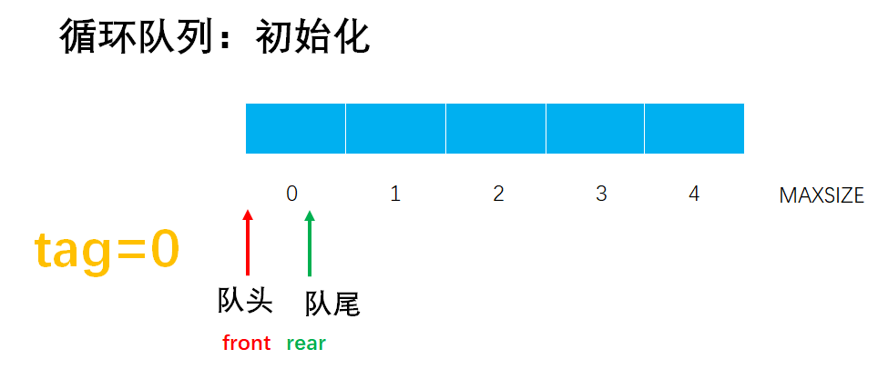
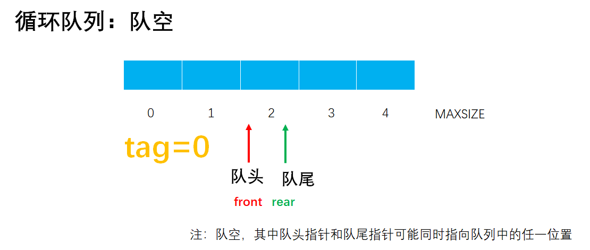
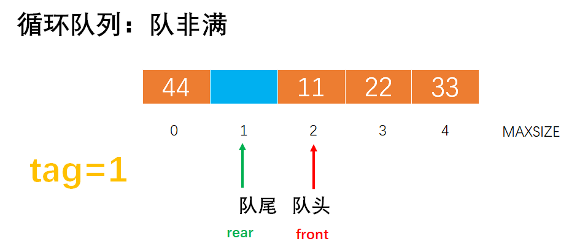
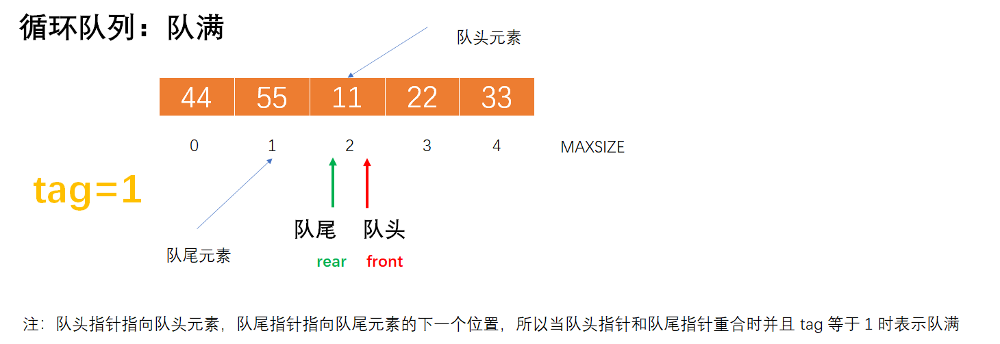
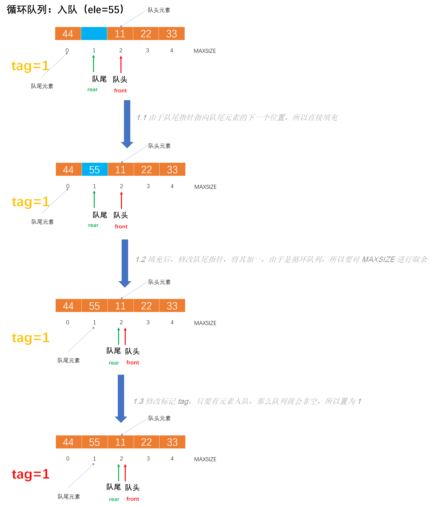
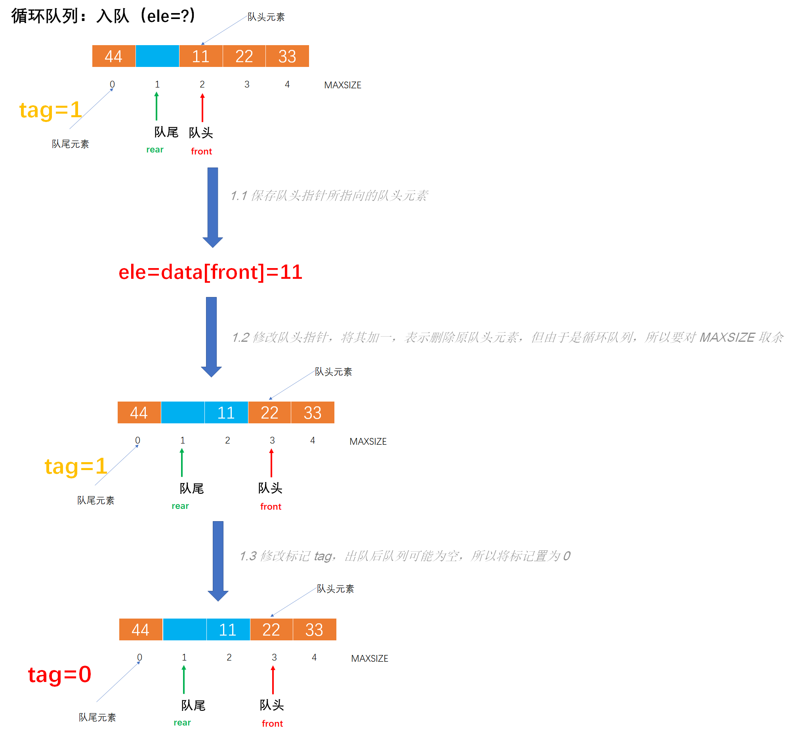

# Example004 

## 题目

设计一个循环队列，用 front 和 rear 分别作为队头和队尾指针，另外用一个标志 tag 表示队列是空还是不空，约定当 tag 为 0 时队空，当 tag 为 1 时队不空，这样就可以用 `front==rear` 作为队满的条件。要求，设计队列的结构和相关基本运算算法（队列元素为 int 型）。


## 分析

在循环队列中，提供的代码中是占用一个数组空间用来判断是否队满，其实还有其他判断队满的方式，以下就是一种：增设一个 tag 整型变量来标识队列是否为空，如果 tag 为 0 标识队空，如果为 1 则表示队满。在入队和出队算法中，在入队时将 tag 置为 1，因为只有入队操作可能导致队满；在出队时将 tag 置为 0，因为只有出队操作可能导致队空。关于使用 tag 标记后循环队列 queue 的操作如下：

- 初始化：`queue.tag=0; queue.front=queue.rear=0;`。
- 队空条件：`queue.front==queue.rear&&queue.tag==0`。
- 队满条件：`queue.front==queue.rear&&queue.tag==1`。
- 入队操作：`queue.data[queue.rear]=ele; queue.rear=(queue.rear+1)%MAXSIZE; queue.tag=1;`。
- 出队操作：`ele=queue.data[queue.front]; queue.front=(queue.front+1)%MAXSIZE; queue.tag=0;`。

注意：

- 在使用 tag 标记的循环队列中，数组如果最大长度为 `MAXSIZE`，那么最多能存储 `MAXSIZE` 个元素。而在提供的循环队列代码中，专门占用了一个数组空间用来判断是否队满，所以最多只能存储 `MAXSIZE-1` 个元素。
- 队头指针 `front` 指向队头元素。队尾指针指向队尾元素的下一个位置。


## 图解

- 初始化：



- 队空：



- 队非满：



- 队满



- 入队



- 出队




## C实现

核心代码：

```c
/**
 * 将元素入队
 * @param queue 循环队列
 * @param ele 待入队的元素
 * @return 如果返回 1 表示入队成功，否则返回 0 表示入队失败
 */
int enQueue(CircularQueue *queue, int ele) {
    // 0.参数校验，如果队满则返回 0
    if (queue->front == queue->rear && queue->tag == 1) {
        return 0;
    }
    // 1.将元素入队
    // 1.1 由于队尾指针指向队尾元素的下一个位置，所以直接填充
    queue->data[queue->rear] = ele;
    // 1.2 填充后，修改队尾指针，将其加一，由于是循环队列，所以要对 MAXSIZE 进行取余
    queue->rear = (queue->rear + 1) % MAXSIZE;
    // 1.3 修改标记 tag，只要有元素入队，那么队列就会非空，所以置为 1
    queue->tag = 1;
    // 1.4 返回 1 表示入队成功
    return 1;
}

/**
 * 将元素出队
 * @param queue 循环队列
 * @param ele 用来保存出队的元素
 * 如果返回 1 表示出队成功，否则返回 0 表示出队失败
 */
int deQueue(CircularQueue *queue, int *ele) {
    // 0.参数校验，如果为空则不能出队返回 0
    if (queue->front == queue->rear && queue->tag == 0) {
        return 0;
    }
    // 1.将元素出队
    // 1.1 保存队头指针所指向的队头元素
    *ele = queue->data[queue->front];
    // 1.2 修改队头指针，将其加一，表示删除原队头元素，但由于是循环队列，所以要对 MAXSIZE 取余
    queue->front = (queue->front + 1) % MAXSIZE;
    // 1.3 修改标记 tag，出队后队列可能为空，所以将标记置为 0
    queue->tag = 0;
    // 1.4 返回 1 表示出队成功
    return 1;
}
```

完整代码：

```c
#include<stdio.h>

/**
 * 循环队列中能存储的最大元素个数
 */
#define MAXSIZE 5

/**
 * 循环队列结构体定义
 */
typedef struct {
    /**
     * 循环队列数据域，存储队列中的元素
     */
    int data[MAXSIZE];
    /**
     * 指针域，存储队头元素的下标
     */
    int front;
    /**
     * 指针域，存储队尾元素的下标
     */
    int rear;
    /**
     * 标志，表示队列是空还是不空，约定当 tag 为 0 时队空，当 tag 为 1 时队不空
     */
    int tag;
} CircularQueue;

/**
 * 初始化循环队列
 * @param queue 未初始化的循环队列
 */
void init(CircularQueue *queue) {
    // 初始化队头和队尾指针，都指向 0
    queue->front = 0;
    queue->rear = 0;
    // 将标志置为 0 表示空队
    queue->tag = 0;
}

/**
 * 判断循环队列是否为空队列
 * @param queue 循环队列
 * @return 如果是空队列则返回 1，否则返回 0
 */
int isEmpty(CircularQueue queue) {
    // 因为标记 tag 用来存储队列是否为空，所以判断标记是否为零即可
    return queue.front == queue.rear && queue.tag == 0;
}

/**
 * 判断循环队列是否为满
 * @param queue 循环队列
 * @return 如果是满队列则返回 1，否则返回 0
 */
int isFull(CircularQueue queue) {
    // 注意，此队列不需要一个额外的空间来判断是否满，所以判断队满的标志是队头指针与队尾指针指向同一个位置
    // 但前提是队列非空，如果队列为空，那么它们也是指向同一个位置的，所以要加上这个条件
    return queue.front == queue.rear && queue.tag == 1;
}

/**
 * 将元素入队
 * @param queue 循环队列
 * @param ele 待入队的元素
 * @return 如果返回 1 表示入队成功，否则返回 0 表示入队失败
 */
int enQueue(CircularQueue *queue, int ele) {
    // 0.参数校验，如果队满则返回 0
    if (queue->front == queue->rear && queue->tag == 1) {
        return 0;
    }
    // 1.将元素入队
    // 1.1 由于队尾指针指向队尾元素的下一个位置，所以直接填充
    queue->data[queue->rear] = ele;
    // 1.2 填充后，修改队尾指针，将其加一，由于是循环队列，所以要对 MAXSIZE 进行取余
    queue->rear = (queue->rear + 1) % MAXSIZE;
    // 1.3 修改标记 tag，只要有元素入队，那么队列就会非空，所以置为 1
    queue->tag = 1;
    // 1.4 返回 1 表示入队成功
    return 1;
}

/**
 * 将元素出队
 * @param queue 循环队列
 * @param ele 用来保存出队的元素
 * 如果返回 1 表示出队成功，否则返回 0 表示出队失败
 */
int deQueue(CircularQueue *queue, int *ele) {
    // 0.参数校验，如果为空则不能出队返回 0
    if (queue->front == queue->rear && queue->tag == 0) {
        return 0;
    }
    // 1.将元素出队
    // 1.1 保存队头指针所指向的队头元素
    *ele = queue->data[queue->front];
    // 1.2 修改队头指针，将其加一，表示删除原队头元素，但由于是循环队列，所以要对 MAXSIZE 取余
    queue->front = (queue->front + 1) % MAXSIZE;
    // 1.3 修改标记 tag，出队后队列可能为空，所以将标记置为 0
    queue->tag = 0;
    // 1.4 返回 1 表示出队成功
    return 1;
}

/**
 * 打印循环队列所有元素，从队头到队尾
 * @param queue 循环队列
 */
void print(CircularQueue queue) {
    // 如果是空队列则单独打印
    if (queue.front == queue.rear && queue.tag == 0) {
        printf("[]\n");
        return;
    }
    // 如果是非空队列
    printf("[");
    int front = queue.front;
    // 注意这里使用的的 do...while 循环，因为满队时，队头指针和队尾指针指向同一个位置，所以要先打印一个值再启动循环
    do {
        printf("%d", queue.data[front]);
        if (front != (queue.rear - 1 + MAXSIZE) % MAXSIZE) {
            printf(", ");
        }
        front = (front + 1) % MAXSIZE;
    } while (front != queue.rear);
    printf("]\n");
}

int main() {
    // 声明循环队列
    CircularQueue queue;

    // 初始化队列
    printf("\n初始化队列：\n");
    init(&queue);
    print(queue);

    // 队列是否空
    printf("\n队列是否空：\n");
    int empty;
    empty = isEmpty(queue);
    printf("%d\n", empty);

    // 将元素入队
    printf("\n将元素入队：\n");
    enQueue(&queue, 11);
    print(queue);
    enQueue(&queue, 22);
    print(queue);
    enQueue(&queue, 33);
    print(queue);
    enQueue(&queue, 44);
    print(queue);
    enQueue(&queue, 55);
    print(queue);

    // 队列是否满
    printf("\n队列是否满：\n");
    int full;
    full = isFull(queue);
    printf("%d\n", full);

    // 将元素出队
    int ele;
    printf("\n将元素出队：\n");
    deQueue(&queue, &ele);
    printf("出队元素：%d\n", ele);
    print(queue);
    deQueue(&queue, &ele);
    printf("出队元素：%d\n", ele);
    print(queue);
    deQueue(&queue, &ele);
    printf("出队元素：%d\n", ele);
    print(queue);

    // 队列是否空
    printf("\n队列是否空：\n");
    empty = isEmpty(queue);
    printf("%d\n", empty);
}
```

执行结果：

```text
初始化队列：
[]

队列是否空：
1

将元素入队：
[11]
[11, 22]
[11, 22, 33]
[11, 22, 33, 44]
[11, 22, 33, 44, 55]

队列是否满：
1

将元素出队：
出队元素：11
[22, 33, 44, 55]
出队元素：22
[33, 44, 55]
出队元素：33
[44, 55]

队列是否空：
0
```


## Java实现

核心代码：

```java
    /**
     * 将元素入队
     *
     * @param ele 待入队的元素
     * @throws Exception 如果队列已满则不能入队则抛出此异常
     */
    public void enQueue(int ele) throws Exception {
        // 0.参数校验，如果队满则抛出异常表示不能入队
        if (isFull()) {
            throw new Exception("队列已满不能入队！");
        }
        // 1.将元素入队
        // 1.1 由于队尾指针指向队尾元素的下一个位置，所以直接填充
        queue.data[queue.rear] = ele;
        // 1.2 填充后，修改队尾指针，将其加一，由于是循环队列，所以要对 MAXSIZE 进行取余
        queue.rear = (queue.rear + 1) % MAXSIZE;
        // 1.3 修改标记 tag，只要有元素入队，那么队列就会非空，所以置为 1
        queue.tag = 1;
    }

    /**
     * 将元素出队
     *
     * @return 出队元素
     * @throws Exception 如果队空则不能出队抛出此异常
     */
    public int deQueue() throws Exception {
        // 0.参数校验，如果为空则不能出队抛出此异常
        if (isEmpty()) {
            throw new Exception("队列为空不能出队！");
        }
        // 1.将元素出队
        // 1.1 保存队头指针所指向的队头元素
        int data = queue.data[queue.front];
        // 1.2 修改队头指针，将其加一，表示删除原队头元素，但由于是循环队列，所以要对 MAXSIZE 取余
        queue.front = (queue.front + 1) % MAXSIZE;
        // 1.3 修改标记 tag，出队后队列可能为空，所以将标记置为 0。
        queue.tag = 0;
        // 1.4 返回队头元素
        return data;
    }
```

完整代码：

```java
public class CircularQueue {
    /**
     * 循环队列中能存储的最大元素个数
     */
    private final int MAXSIZE = 5;
    /**
     * 声明一个循环队列
     */
    private Queue queue;

    /**
     * 初始化循环队列
     */
    public void init() {
        // 实例化对象
        queue = new Queue();
        // 为数据域分配存储空间
        queue.data = new int[MAXSIZE];
        // 将队头指针和队尾指针都指向 0
        queue.front = 0;
        queue.rear = 0;
        // 将标记置为 0，表示空队列
        queue.tag = 0;
    }

    /**
     * 判断循环队列是否为空队列
     *
     * @return 如果是空队列则返回 true，否则返回 false
     */
    public boolean isEmpty() {
        // 因为标记 tag 用来存储队列是否为空，所以判断标记是否为零即可
        return queue.front == queue.rear && queue.tag == 0;
    }

    /**
     * 判断循环队列是否为满
     *
     * @return 如果是满队列则返回 true，否则返回 false
     */
    public boolean isFull() {
        // 注意，此队列不需要一个额外的空间来判断是否满，所以判断队满的标志是队头指针与队尾指针指向同一个位置
        // 但前提是队列非空，如果队列为空，那么它们也是指向同一个位置的，所以要加上这个条件
        return queue.front == queue.rear && queue.tag == 1;
    }

    /**
     * 将元素入队
     *
     * @param ele 待入队的元素
     * @throws Exception 如果队列已满则不能入队则抛出此异常
     */
    public void enQueue(int ele) throws Exception {
        // 0.参数校验，如果队满则抛出异常表示不能入队
        if (isFull()) {
            throw new Exception("队列已满不能入队！");
        }
        // 1.将元素入队
        // 1.1 由于队尾指针指向队尾元素的下一个位置，所以直接填充
        queue.data[queue.rear] = ele;
        // 1.2 填充后，修改队尾指针，将其加一，由于是循环队列，所以要对 MAXSIZE 进行取余
        queue.rear = (queue.rear + 1) % MAXSIZE;
        // 1.3 修改标记 tag，只要有元素入队，那么队列就会非空，所以置为 1
        queue.tag = 1;
    }

    /**
     * 将元素出队
     *
     * @return 出队元素
     * @throws Exception 如果队空则不能出队抛出此异常
     */
    public int deQueue() throws Exception {
        // 0.参数校验，如果为空则不能出队抛出此异常
        if (isEmpty()) {
            throw new Exception("队列为空不能出队！");
        }
        // 1.将元素出队
        // 1.1 保存队头指针所指向的队头元素
        int data = queue.data[queue.front];
        // 1.2 修改队头指针，将其加一，表示删除原队头元素，但由于是循环队列，所以要对 MAXSIZE 取余
        queue.front = (queue.front + 1) % MAXSIZE;
        // 1.3 修改标记 tag，出队后队列可能为空，所以将标记置为 0。
        queue.tag = 0;
        // 1.4 返回队头元素
        return data;
    }

    /**
     * 打印循环队列所有元素，从队头到队尾
     */
    public void print() {
        // 如果是空队列则单独打印
        if (queue.front == queue.rear && queue.tag == 0) {
            System.out.println("[]");
            return;
        }
        // 如果是非空队列
        System.out.print("[");
        int front = queue.front;
        // 注意这里使用的的 do...while 循环，因为满队时，队头指针和队尾指针指向同一个位置，所以要先打印一个值再启动循环
        do {
            System.out.print(queue.data[front]);
            if (front != (queue.rear - 1 + MAXSIZE) % MAXSIZE) {
                System.out.print(", ");
            }
            front = (front + 1) % MAXSIZE;
        } while (front != queue.rear);
        System.out.print("]\n");
    }
}

/**
 * 循环队列定义
 */
class Queue {
    /**
     * 循环队列数据域，存储队列中的元素
     */
    int[] data;
    /**
     * 指针域，存储队头元素的下标
     */
    int front;
    /**
     * 指针域，存储队尾元素的下标
     */
    int rear;
    /**
     * 标志，表示队列是空还是不空，约定当 tag 为 0 时队空，当 tag 为 1 时队不空
     */
    int tag;
}
```

测试代码：

```java
public class CircularQueueTest {
    public static void main(String[] args) throws Exception {
        // 声明循环队列
        CircularQueue queue = new CircularQueue();

        // 初始化队列
        System.out.print("\n初始化队列：\n");
        queue.init();
        queue.print();

        // 队列是否空
        System.out.print("\n队列是否空：\n");
        boolean empty;
        empty = queue.isEmpty();
        System.out.println(empty);

        // 将元素入队
        System.out.print("\n将元素入队：\n");
        queue.enQueue(11);
        queue.print();
        queue.enQueue(22);
        queue.print();
        queue.enQueue(33);
        queue.print();
        queue.enQueue(44);
        queue.print();
        queue.enQueue(55);
        queue.print();

        // 队列是否满
        System.out.print("\n队列是否满：\n");
        boolean full;
        full = queue.isFull();
        System.out.println(full);

        // 将元素出队
        int ele;
        System.out.print("\n将元素出队：\n");
        ele = queue.deQueue();
        System.out.println("出队元素：" + ele);
        queue.print();
        ele = queue.deQueue();
        System.out.println("出队元素：" + ele);
        queue.print();
        ele = queue.deQueue();
        System.out.println("出队元素：" + ele);
        queue.print();

        // 队列是否空
        System.out.print("\n队列是否空：\n");
        empty = queue.isEmpty();
        System.out.println(empty);
    }
}
```

执行结果：

```text
初始化队列：
[]

队列是否空：
true

将元素入队：
[11]
[11, 22]
[11, 22, 33]
[11, 22, 33, 44]
[11, 22, 33, 44, 55]

队列是否满：
true

将元素出队：
出队元素：11
[22, 33, 44, 55]
出队元素：22
[33, 44, 55]
出队元素：33
[44, 55]

队列是否空：
false
```