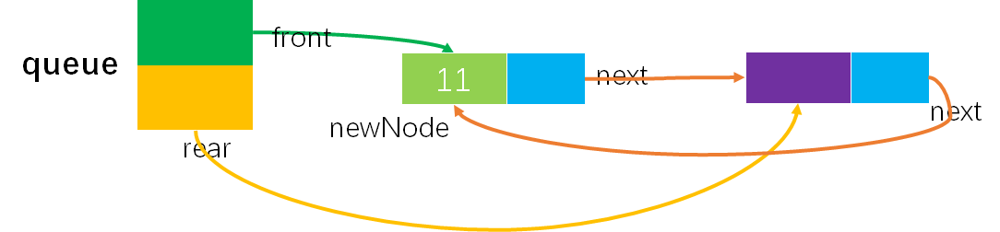

# Example006 

## 题目

请设计一个队列，要求满足：
- ①初始时队列为空；
- ②入队时，允许增加队列占用空间；
- ③出队后，出队元素所占用的空间可重复使用，即整个队列所占用的空间只增不减；
- ④入队操作和出队操作的时间复杂度始终保持为O(1)。

请回答下列问题：

- 1）该队列是应选择链式存储结构，还是应选择顺序存储结构?
- 2）画出队列的初始状态，并给出判断队空和队满的条件。
- 3）画出第一个元素入队后的队列状态。
- 4）给出入队操作和出队操作的基本过程。


## 分析

本题很难，毕竟是 408 统考真题，也没有要求写代码。但如果通过画图那么还是很容易理解到如何出队和入队的。题解如下：

**1）该队列是应选择链式存储结构，还是应选择顺序存储结构?**

- 要求①很容易满足，因为初始化队列都是空的；
- 对于要求②，可以使用链式存储，每次入队新元素时便创建新结点并分配空间，这样也增加了队列空间。而顺序存储空间是一开始就分配好的，队列的占用空间无法随着入队操作而增加，所以需要选择链式存储结构。
- 对于要求③，要求出队元素的空间可以重复使用，即即使链队结点出队后，也不要释放空间，以前的链表删除操作都会释放掉被删结点的空间。我们可以这样操作：对出队后的结点不真正释放（即不调用 `free` 函数释放空间），而是用队头指针指向新的队头结点，原队头结点仍然保留在链式队列中，但队头指针却不指向它了；而有新元素入队时，有空余结点则无需创建新结点开辟新空间，直接赋值到队尾后的第一个空结点即可，然后用队尾指针指向新的队尾结点。这就要求设计成一个首尾相接的循环单链表，即链式循环队列。
- 对于要求④，由于有队头指针和队尾指针，所以链式循环队列的入队操作和出队操作的时间复杂度都是 `O(1)`。

**2）画出队列的初始状态，并给出判断队空和队满的条件。**

该链式循环队列的实现可以参考顺序循环队列，不同之处在于链式循环队列可以动态地增加空间，出队的结点也可以循环利用，入队时空间不够也可以动态增加。同样，链式循环队列，也需要区分队满和队空的情况，这里参考顺序循环队列牺牲一个单元来判断，即在链式循环队列中有一个结点是不存储任何数据的，仅用来判断链式循环队列是队满还是队空。初始化时，创建一个只有空闲结点（初始时就必须有这个空闲结点，用来判断队空和队满的空闲结点）循环单链表，队头指针 front 和队尾指针 rear 均指向空闲结点，如图所示：


- 队空的判定条件：`queue->front==queue->rear`。
- 队满的判定条件：`queue->front==queue->rear->next`。

> 注：
>
> - 初始时，无论是队空的判定还是队满的判定条件都能通过，所以初始时既是队空也是队满。
> - 链式循环队列不存在队满的。由于在出队后，结点空间不会释放掉，所以会一直存在，那么队满的判定条件就会返回 0，表示可以直接利用空余结点来存储新元素。如果再入队，那么就会把空余结点也给用完，那时候就存在队满了，即没有空余结点就是队满状态。如果只是一直入队那么一直都是队满状态。
> - 上图只是初始化图，是不太容易看得出到底是队空还是队满的，可以看看下图：


**3）画出第一个元素入队后的队列状态。**

插入第一个元素后的状态如图所示：


> 注：有些书上是将新结点放在空闲结点（即图中的紫色结点）前面，我在这里面踩了一些坑，这样的做法是很不容易插入新结点的，代码不太好写，所以不推荐。如下图所示：



**4）给出入队操作和出队操作的基本过程。**

如果是3）中第一张图的作法，那么操作的基本过程如下：

```c
// 入队操作
if(queue->front==queue->rear->next) {// 队满
    创建新结点 newNode 并为其分配空间;
    newNode->next=queue->rear->next;
    queue->rear->next=newNode;
    queue->rear=newNode;
} else {// 队未满
    queue->rear=queue->rear->next;
    queue->rear->data=ele;
}

// 出队操作
if(queue->front==queue->rear) {// 队空
    则出队失败，返回;
} else {// 队非空
    queue->front=queue->front->next;
    ele=queue->front->data;
}
```

如果是3）中第二张图的作法，那么操作的基本过程如下：

```c
// 入队操作
if(queue->front==queue->rear->next) //队满
    则在 rear 后面插入一个新的空闲结点;
入队元素保存到 rear 所指结点中;
queue->rear=queue->rear->next;
返回;

// 出队操作
if(queue->front==queue->rear) //队空
    则出队失败然后返回;
取 front 所指结点中的元素 ele;
queue->front=queue->front->next;
返回 ele;
```

> 注：如果是3）中第一张图的作法，则入队多个元素后如图所示：


> 注：如果是3）中第二张图的作法，则入队多个元素后如图所示：


> 注：之所以要指出这种区别，是为了不陷入某些参考书中，选择自己能理解的解法即可。本题后面采用的是3）中第一张图的做法。


## 图解

- 初始化链式循环队列


- 队满与队未满状态


- 队空与队非空


- 入队（在队已满情况下）


- 出队


- 入队（在队未满情况下）


## C实现

核心代码：

```c
/**
 * 将元素入队
 * @param queue 链队列
 * @param ele 待入队的元素
 */
void enQueue(LinkedQueue **queue, int ele) {
    // 如果链式队列已满，则创建新结点进行插入
    if (isFull(*queue)) {
        // 创建新结点
        QNode *newNode = (QNode *) malloc(sizeof(QNode));
        newNode->data = ele;
        newNode->next = NULL;
        // 将新结点插入
        newNode->next = (*queue)->rear->next;
        (*queue)->rear->next = newNode;
        (*queue)->rear = newNode;
    }
        // 如果链式队列未满，则直接利用已有结点的空间，而不必创建新结点
    else {
        (*queue)->rear = (*queue)->rear->next;
        (*queue)->rear->data = ele;
    }
}

/**
 * 将元素出队
 * @param queue 链队列
 * @param ele 用来保存出队元素
 * @return 如果链队列为空则不能出队则返回 0 表示出队失败；否则返回 1 表示出队成功
 */
int deQueue(LinkedQueue **queue, int *ele) {
    if (isEmpty(*queue)) {
        return 0;
    } else {
        (*queue)->front = (*queue)->front->next;
        *ele = (*queue)->front->data;
        return 1;
    }
}
```

完整代码：

```c
#include<stdio.h>
#include<stdlib.h>

/**
 * 链队列中的结点结构体定义
 */
typedef struct QNode {
    /**
     * 结点数据域，存储链队列中结点的数据
     */
    int data;
    /**
     * 结点指针域，存储当前结点的后继结点的地址
     */
    struct QNode *next;
} QNode;

/**
 * 链队列结构体定义
 */
typedef struct {
    /**
     * 存储链队列的队头结点的地址，即指向队头结点
     */
    QNode *front;
    /**
     * 存储链队列的队尾结点的地址，即指向队尾结点
     */
    QNode *rear;
} LinkedQueue;

/**
 * 初始化链队列
 * @param queue 未初始化的链队列
 */
void init(LinkedQueue **queue) {
    // 其实 queue 就相当于链队列的头结点，不过它有两个指针，分别存储队头结点和队尾结点的地址
    // 为链队列头结点分配存储空间
    *queue = (LinkedQueue *) malloc(sizeof(LinkedQueue));
    // 将队头指针和队尾指针都指向 NULL，表示空队列
    (*queue)->front = NULL;
    (*queue)->rear = NULL;
    // 创建一个结点用于来判断链式循环队列是否队满或队空
    QNode *node = (QNode *) malloc(sizeof(QNode));
    node->next = node;
    // 将队列的 front 和 rear 都指向 node 结点
    (*queue)->front = node;
    (*queue)->rear = node;
}

/**
 * 判断链队列是否为空
 * @param queue 链队列
 * @return 如果链队列为空则返回 1，否则返回 0 表示非空
 */
int isEmpty(LinkedQueue *queue) {
    if (queue->front == queue->rear) {
        return 1;
    } else {
        return 0;
    }
}

/**
 * 判断链队列是否已满
 * @param queue 链队列
 * @return 如果队满则返回 1，否则返回 0
 */
int isFull(LinkedQueue *queue) {
    if (queue->front == queue->rear->next) {
        return 1;
    } else {
        return 0;
    }
}

/**
 * 将元素入队
 * @param queue 链队列
 * @param ele 待入队的元素
 */
void enQueue(LinkedQueue **queue, int ele) {
    // 如果链式队列已满，则创建新结点进行插入
    if (isFull(*queue)) {
        // 创建新结点
        QNode *newNode = (QNode *) malloc(sizeof(QNode));
        newNode->data = ele;
        newNode->next = NULL;
        // 将新结点插入
        newNode->next = (*queue)->rear->next;
        (*queue)->rear->next = newNode;
        (*queue)->rear = newNode;
    }
        // 如果链式队列未满，则直接利用已有结点的空间，而不必创建新结点
    else {
        (*queue)->rear = (*queue)->rear->next;
        (*queue)->rear->data = ele;
    }
}

/**
 * 将元素出队
 * @param queue 链队列
 * @param ele 用来保存出队元素
 * @return 如果链队列为空则不能出队则返回 0 表示出队失败；否则返回 1 表示出队成功
 */
int deQueue(LinkedQueue **queue, int *ele) {
    if (isEmpty(*queue)) {
        return 0;
    } else {
        (*queue)->front = (*queue)->front->next;
        *ele = (*queue)->front->data;
        return 1;
    }
}

/**
 * 获取链队列中的结点个数
 * @param queue 链队列
 * @return 结点个数
 */
int size(LinkedQueue *queue) {
    // 变量，记录链队列结点个数
    int len = 0;
    // 变量，结点链队列的队头结点，相当于单链表的开始结点
    QNode *node = queue->front->next;
    // 扫描链队列，即遍历单链表，统计结点个数
    while (node != queue->front) {
        len++;
        node = node->next;
    }
    return len;
}

/**
 * 获取链队列的队头结点数据值
 * @param queue 链队列
 * @param ele 用来保存队头结点数据值
 * @return 如果链队列为空则返回 0 表示获取失败，否则返回 1 表示获取成功
 */
int getFront(LinkedQueue *queue, int *ele) {
    // 0.参数校验，如果链队列为空，则表示不能获取队头元素
    if (isEmpty(queue)) {
        return 0;
    }
    // 1.用 ele 保存队头结点的数据值，即队头指针所指向的后继结点的数据域
    *ele = queue->front->next->data;
    return 1;
}

/**
 * 获取链队列的队尾结点数据值
 * @param queue 链队列
 * @param ele 用来保存队尾结点数据值
 * @return 如果链队列为空则返回 0 表示获取失败，否则返回 1 表示获取成功
 */
int getRear(LinkedQueue *queue, int *ele) {
    // 0.参数校验，如果链队列为空，则表示不能获取队尾元素
    if (isEmpty(queue)) {
        return 0;
    }
    // 1.用 ele 保存队尾结点的数据值，即队尾指针所指向的结点
    *ele = queue->rear->data;
    return 1;
}

/**
 * 打印链队列的所有结点值
 * @param queue 链队列
 */
void print(LinkedQueue *queue) {
    printf("[");
    QNode *frontNode = queue->front;
    QNode *node = frontNode->next;
    // 对于队满和队非满两种情况
    if (isFull(queue)) {
        while (node != frontNode) {
            printf("%d", node->data);
            if (node->next != frontNode) {
                printf(", ");
            }
            node = node->next;
        }
    } else {
        while (node != queue->rear) {
            printf("%d", node->data);
            if (node->next != queue->rear) {
                printf(", ");
            }
            node = node->next;
        }
        printf(", %d", queue->rear->data);
    }
    printf("]\n");
}


int main() {
    // 声明链队列
    LinkedQueue *queue;

    // 初始化链队列
    printf("\n初始化链队列：\n");
    init(&queue);
    print(queue);

    // 队列是否为空
    printf("\n队列是否为空：\n");
    int empty;
    empty = isEmpty(queue);
    printf("%d\n", empty);

    // 将元素入队
    printf("\n将元素入队：\n");
    enQueue(&queue, 11);
    print(queue);
    enQueue(&queue, 22);
    print(queue);
    enQueue(&queue, 33);
    print(queue);
    enQueue(&queue, 44);
    print(queue);

    // 队列是否已满
    printf("\n队列是否已满：\n");
    int full;
    full = isFull(queue);
    printf("%d\n", full);

    // 将元素出队
    printf("\n将元素出队：\n");
    int ele;
    deQueue(&queue, &ele);
    printf("出队元素：%d\n", ele);
    print(queue);
    deQueue(&queue, &ele);
    printf("出队元素：%d\n", ele);
    print(queue);

    // 队列是否已满
    printf("\n队列是否已满：\n");
    full = isFull(queue);
    printf("%d\n", full);

    // 再将元素入队
    printf("\n将元素入队：\n");
    enQueue(&queue, 55);
    print(queue);
    enQueue(&queue, 66);
    print(queue);

    // 队列是否已满
    printf("\n队列是否已满：\n");
    full = isFull(queue);
    printf("%d\n", full);

    // 队头元素
    printf("\n队头元素：\n");
    int front;
    getFront(queue, &front);
    printf("%d\n", front);

    // 队尾元素
    printf("\n队尾元素：\n");
    int rear;
    getRear(queue, &rear);
    printf("%d\n", rear);

    // 队列元素个数
    printf("\n队列元素个数：\n");
    int len;
    len = size(queue);
    printf("%d\n", len);
}
```

执行结果：

```text
初始化链队列：
[]

队列是否为空：
1

将元素入队：
[11]
[11, 22]
[11, 22, 33]
[11, 22, 33, 44]

队列是否已满：
1

将元素出队：
出队元素：11
[22, 33, 44]
出队元素：22
[33, 44]

队列是否已满：
0

将元素入队：
[33, 44, 55]
[33, 44, 55, 66]

队列是否已满：
1

队头元素：
33

队尾元素：
66

队列元素个数：
4
```


## Java实现

略。
